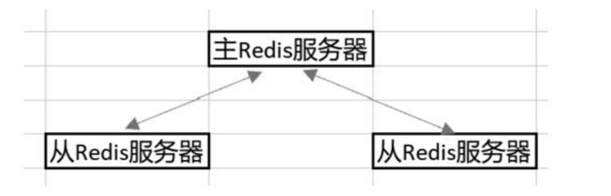
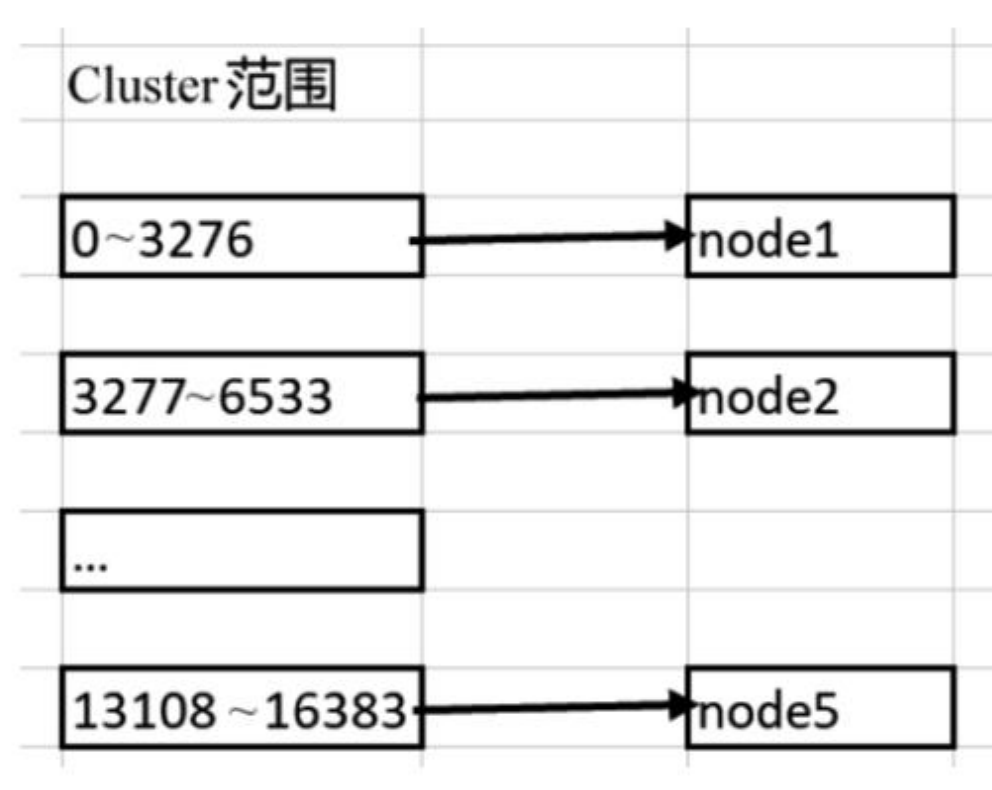

# 1.1 Redis概述

Redis(**Remote Dictionary Server**)是由Salvatore Sanfilippo开发的**key-value(键值对)存储系统**.Redis属于NoSQL数据库,进一步讲,Redis是**基于键值对存储的NoSQL数据库**.

## 1.1.1 对比传统数据库与NoSQL数据库

NoSQL使用比较简单的数据结构来保存数据,比如Redis用的就是键值对.NoSQL数据库更适用于"数据量小但对性能有一定要求"的场景

## 1.1.2 Redis的特点

优点:

1. 由于数据是存储在内存中的,因此查找数据的速度比较快
2. 支持的数据类型比较多,比如支持字符串、列表和哈希表等
3. **可以支持事务**,同时支持数据的持久化,即能把内存中的数据存入硬盘

缺点:

1. Redis**难以支持在线扩容**.尤其是在集群场景里,当存储容量达到上限后,在线扩容会非常困难
2. Redis是基于内存的,如果短时间内存入大量数据,可能会导致内存问题,比如会出现OOM(内存溢出)异常
3. Redis工作时是**基于单线程**的,所以无法充分利用多核机器里的CPU

基于Redis的优缺点,一般会将它用在缓存、秒杀、计数器和排行榜等**和性能密切相关的场景**里

## 1.1.3 Redis更适合以分布式集群的方式提供服务

##### a. 基于主从复制的Redis集群

能避免因单节点失效而带来的服务不可用,且能实现读写分离,以提升Redis系统的并发量

##### b. 基于Cluster的Redis集群

基于Cluster(槽)的集群能有效扩展Redis缓存的容量,应对高并发场景下的缓存需求