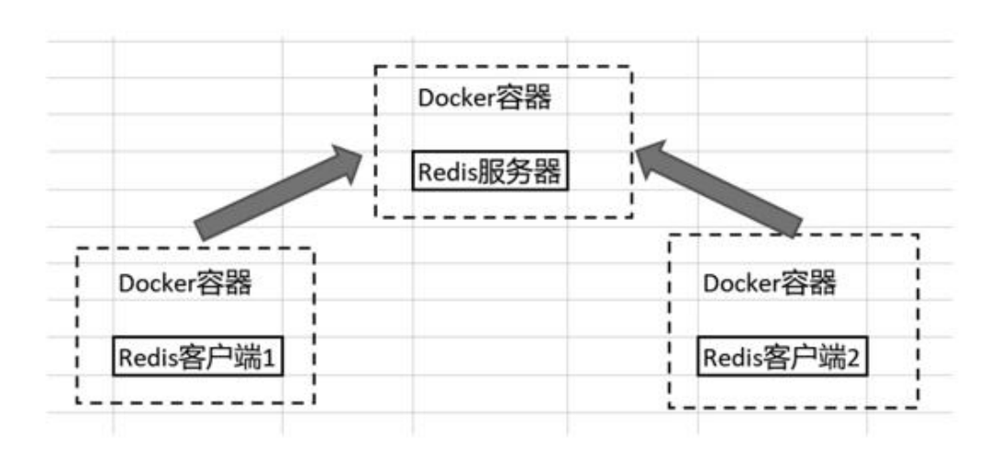

# 4.4 多个客户端连接远端服务器

## 4.4.1 多个Redis客户端连接远端服务器

在本节中,将新建三个Docker容器,以此模拟三台主机.在这三个Docker容器里,包含了一个Redis服务器、两个Redis客户端,并且两个Redis客户端会连接到Redis服务器上,以此模拟两台主机上的Redis客户端远程连接到Redis服务器上的效果.具体的效果图如下图示.

两台Redis客户端远程连接到Redis服务器的效果



- step1. 创建表示redis-server的容器

```
(base) root@yuanhong StudyRedisBaseOnDocker % docker run --name redis-server -d redis:latest
834148eedc13916828f2c1dc72a6b8df30cfcde01b91b128ab099617008035e4
```

- step2. 创建并进入Redis客户端容器,在该容器内连接redis-server

创建并进入Redis客户端容器:

```
(base) root@yuanhong StudyRedisBaseOnDocker % docker run -it --name redis-client1 --link redis-server:server redis:latest /bin/bash
root@b33298a59a78:/data# 
```

注:`--link`选项的含义:

在Docker的早期版本中,`--link`选项是用来在两个容器之间建立一个链接的.这意味着从一个容器可以安全地连接到另一个容器,而无需公开任何不必要的端口到宿主机.当您使用`--link`选项时,Docker会在两个容器之间建立一个私有网络连接,并将链接的容器的环境变量、主机名和其他相关信息传递给源容器.这使得源容器可以轻松地发现和连接到链接的容器.

语法:`--link 链接容器名称:源容器内的主机名`

连接redis-server:

```
root@b33298a59a78:/data# redis-cli -h server -p 6379
server:6379> 
```

- step3. 尝试在客户端执行命令

```
server:6379> SET name Peter
OK
```

- step4. 再打开一个cmd窗口,再创建一个redis客户端容器

```
(base) root@yuanhong StudyRedisBaseOnDocker % docker run -it --name redis-client2 --link redis-server:server redis:latest /bin/bash
root@6945b1178f8c:/data# 
```

## 4.4.2 通过docker inspect命令观察IP地址

- step1. 检查redis-server容器的IP地址

```
(base) root@yuanhong ~ % docker inspect redis-server|grep IPAddress
            "SecondaryIPAddresses": null,
            "IPAddress": "172.17.0.2",
                    "IPAddress": "172.17.0.2",
```

可以看到,名为`redis-server`的容器,其IP地址为`172.17.0.2`

- step2. 检查redis-client1容器的IP地址

```
(base) root@yuanhong ~ % docker inspect redis-client1|grep IPAddress
            "SecondaryIPAddresses": null,
            "IPAddress": "172.17.0.3",
                    "IPAddress": "172.17.0.3",
```

可以看到,名为`redis-client1`的容器,其IP地址为`172.17.0.3`

- step3. 检查redis-client2容器的IP地址

```
(base) root@yuanhong ~ % docker inspect redis-client2|grep IPAddress
            "SecondaryIPAddresses": null,
            "IPAddress": "172.17.0.4",
                    "IPAddress": "172.17.0.4",
```

可以看到,名为`redis-client2`的容器,其IP地址为`172.17.0.4`

## 4.4.3 实践客户端命令

在redis-client1容器中,查看连接到Redis服务器的所有客户端信息:

```
server:6379> CLIENT LIST
id=3 addr=172.17.0.3:49948 laddr=172.17.0.2:6379 fd=8 name= age=724 idle=0 flags=N db=0 sub=0 psub=0 multi=-1 qbuf=26 qbuf-free=40928 argv-mem=10 obl=0 oll=0 omem=0 tot-mem=61466 events=r cmd=client user=default redir=-1
id=4 addr=172.17.0.4:39362 laddr=172.17.0.2:6379 fd=9 name= age=4 idle=4 flags=N db=0 sub=0 psub=0 multi=-1 qbuf=0 qbuf-free=0 argv-mem=0 obl=0 oll=0 omem=0 tot-mem=20496 events=r cmd=command user=default redir=-1
```

从2个连接的`addr`和`laddr`属性可以看出,和上一小节中获取的容器IP地址是相同的

设置redis-client1的连接名为client1:

```
server:6379> CLIENT GETNAME
(nil)
server:6379> CLIENT SETNAME client1
OK
server:6379> CLIENT GETNAME
"client1"
```

注:此时若在任意一个redis客户端上执行`SHUTDOWN`命令,则redis服务端和客户端都会关闭连接.该命令很容易造成生产事故!

## 4.4.4 通过info观察服务器状态

在redis-client2容器内连接redis-server后,查看服务器状态:

```
server:6379> INFO Stats
# Stats
total_connections_received:2
total_commands_processed:9
instantaneous_ops_per_sec:0
total_net_input_bytes:354
total_net_output_bytes:45639
instantaneous_input_kbps:0.00
instantaneous_output_kbps:0.00
rejected_connections:0
sync_full:0
sync_partial_ok:0
sync_partial_err:0
expired_keys:0
expired_stale_perc:0.00
expired_time_cap_reached_count:0
expire_cycle_cpu_milliseconds:39
evicted_keys:0
keyspace_hits:0
keyspace_misses:0
pubsub_channels:0
pubsub_patterns:0
latest_fork_usec:0
total_forks:0
migrate_cached_sockets:0
slave_expires_tracked_keys:0
active_defrag_hits:0
active_defrag_misses:0
active_defrag_key_hits:0
active_defrag_key_misses:0
tracking_total_keys:0
tracking_total_items:0
tracking_total_prefixes:0
unexpected_error_replies:0
total_error_replies:2
dump_payload_sanitizations:0
total_reads_processed:12
total_writes_processed:11
io_threaded_reads_processed:0
io_threaded_writes_processed:0
```

注:此处只查看了Stats部分的内容

在redis-client1容器中执行一些命令:

```
server:6379> SET salary 10000
OK
server:6379> SET gender male
OK
```

再次在redis-client2容器中查看服务器状态:

```
server:6379> INFO Stats
# Stats
total_connections_received:2
total_commands_processed:12
instantaneous_ops_per_sec:0
total_net_input_bytes:450
total_net_output_bytes:46610
instantaneous_input_kbps:0.00
instantaneous_output_kbps:0.00
rejected_connections:0
sync_full:0
sync_partial_ok:0
sync_partial_err:0
expired_keys:0
expired_stale_perc:0.00
expired_time_cap_reached_count:0
expire_cycle_cpu_milliseconds:41
evicted_keys:0
keyspace_hits:0
keyspace_misses:0
pubsub_channels:0
pubsub_patterns:0
latest_fork_usec:0
total_forks:0
migrate_cached_sockets:0
slave_expires_tracked_keys:0
active_defrag_hits:0
active_defrag_misses:0
active_defrag_key_hits:0
active_defrag_key_misses:0
tracking_total_keys:0
tracking_total_items:0
tracking_total_prefixes:0
unexpected_error_replies:0
total_error_replies:2
dump_payload_sanitizations:0
total_reads_processed:15
total_writes_processed:14
io_threaded_reads_processed:0
io_threaded_writes_processed:0
```

可以看到`total_commands_processed`配置项发生了变化