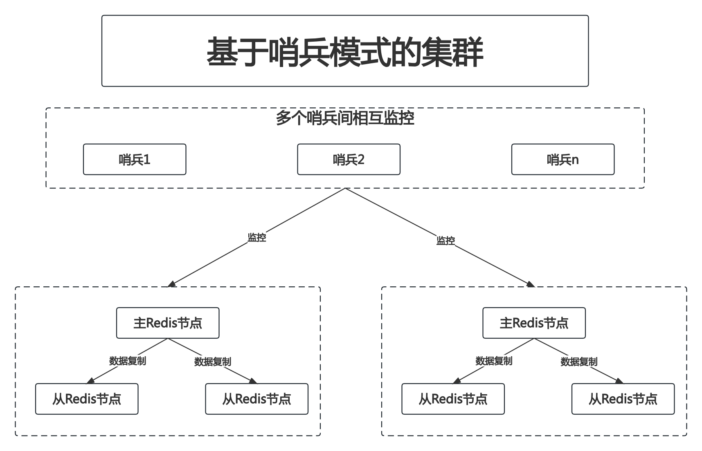
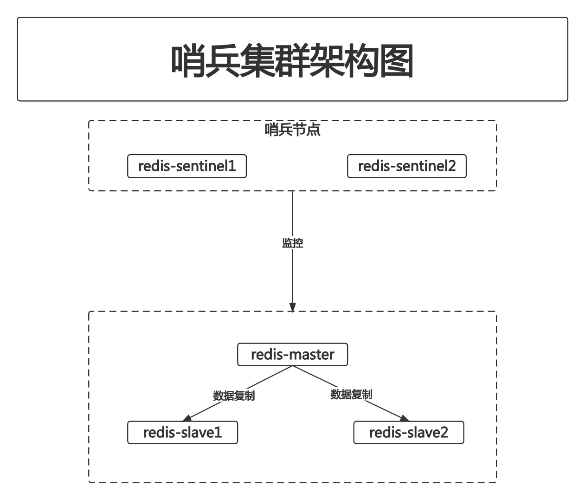

# 7.2 搭建哨兵模式的集群

在上文提到的主从复制模式的集群里,一方面可以提升数据的安全性,比如主服务器失效后,可以启动从服务器上的备份数据,另一方面也可以通过读写分离来提升性能.但是当主服务器发生故障后,需要手动进行数据恢复动作.比如让应用程序连到从服务器上,同时需要重新设置主从关系.

也就是说,基于主从复制模式的集群在发生故障时可能会出现数据丢失等情况,对此可以在主从模式的基础上再引入"哨兵(Sentinel)"机制,一方面用哨兵进程监控主从服务器是否可用,另一方面当主服务器故障发生时通过哨兵机制可以实现"故障自动恢复"的效果.

## 7.2.1 哨兵模式概述

一般来说,哨兵机制会和主从复制模式整合使用,**在基于哨兵的模式里会在一台或多台服务器上引入哨兵进程,这些节点也叫哨兵节点**

哨兵节点一般不存储数据,它的作用是监控主从模式里的主服务器节点.当哨兵节点监控的主服务器发生故障时,哨兵节点会主导"故障自动恢复"的流程,具体来讲就是会在该主服务器下属的从服务器中选出一个新的主服务器,并完成相应的数据和配置更改动作

也就是说,如果采用这种模式,可以让故障自动修复,从而提升系统的可用性.在项目中,一般会配置多个主从模式集群,所以会引入多个哨兵节点.如下图示:



****

多个哨兵相互监控的目的:

当一个Sentinel节点检测到Redis主服务器可能出现问题时,它不会立即采取行动.相反,它会询问其他Sentinel节点以验证其观察结果.只有当足够数量的Sentinel节点同意主服务器出现问题时(这是通过`sentinel monitor`配置中的仲裁值定义的),故障转移过程才会开始

此外,Sentinel节点之间的通信还有其他几个目的:

1. **选举新的领导者**:当主服务器被认为是下线的并且需要进行故障转移时,Sentinel节点之间会进行选举,选择一个Sentinel作为领导者来执行故障转移

2. **配置同步**:当一个Sentinel节点检测到主服务器的配置更改(例如IP地址或端口更改)时,它会通知其他Sentinel节点

3. **状态信息共享**:Sentinel节点之间会定期交换关于它们监视的Redis服务器的状态信息

为了实现Sentinel之间的这种通信,你需要确保Sentinel配置中的`sentinel announce-ip`和`sentinel announce-port`已正确设置,并且所有Sentinel节点都可以互相访问.这通常在启动Sentinel时会自动进行,但在某些网络配置或Docker环境中可能需要手动设置

****

## 7.2.2 搭建哨兵模式集群

- step1. 按7.1小节的步骤启动一个1主2从的redis集群

- step2. 编写哨兵节点1的配置文件

```
(base) root@192 section7-2 % cat sentinel_1.conf 
# 指定哨兵进程监听的端口
port 16379

# 指定sentinel监视的redis服务器信息和判定不可用的条件
# 其中:
# sentinel monitor: 这是一个命令 告诉Sentinel监视一个Redis服务器
# redis-master-node: 被监视的Redis服务器的名字 任意命名即可
# 172.17.0.2: 被监视的Redis服务器的IP地址
# 6379: 被监视的Redis服务器的端口号
# 2: 仲裁值.即Sentinel判定Redis服务器是不可用的前提条件.
# 表示当至少有2个Sentinel报告说Redis服务器是不可用的时,才认为该服务器是不可用的
# 这可以防止一个Sentinel因为网络问题或其他原因错误地认为主服务器是不可用的
sentinel monitor redis-master-node 172.17.0.2 6379 2

# 指定被监视的redis服务器的用户名
sentinel auth-user redis-master-node master_user

# 指定被监视的redis服务器的密码
sentinel auth-pass redis-master-node master_password

# 指定哨兵节点的日志文件位置
dir /

# 指定哨兵节点的日志文件名称
logfile sentinel_1.log
```

- step3. 启动哨兵节点1容器

创建容器:

```
(base) root@192 section7-2 % docker run -itd --name redis-sentinel1 -v /StudyRedisBaseOnDocker/conf/chapter7/section7-2/sentinel_1.conf:/redisConf/sentinel_1.conf:rw -p 16379:16379 redis:latest redis-sentinel /redisConf/sentinel_1.conf
e4ff677f7c7ee7f256a65ec0e1a092b9bc229963f124f5c7d988de3276d6b190
```

查看容器状态:

```
(base) root@192 section7-2 % docker ps
CONTAINER ID   IMAGE          COMMAND                  CREATED         STATUS          PORTS                                NAMES
e4ff677f7c7e   redis:latest   "docker-entrypoint.s…"   3 seconds ago   Up 2 seconds    6379/tcp, 0.0.0.0:16379->16379/tcp   redis-sentinel1
fc6d5912a8dc   redis:latest   "docker-entrypoint.s…"   8 hours ago     Up 23 minutes   6379/tcp, 0.0.0.0:6381->6381/tcp     redis-slave2
2e52199b473c   redis:latest   "docker-entrypoint.s…"   8 hours ago     Up 23 minutes   6379/tcp, 0.0.0.0:6380->6380/tcp     redis-slave1
689437cb98ce   redis:latest   "docker-entrypoint.s…"   9 hours ago     Up 23 minutes   0.0.0.0:6379->6379/tcp               redis-master
```

- step4. 进入哨兵节点1容器,查看哨兵节点信息

```
root@e4ff677f7c7e:/data# redis-cli -h 127.0.0.1 -p 16379
127.0.0.1:16379> INFO sentinel
# Sentinel
sentinel_masters:1
sentinel_tilt:0
sentinel_running_scripts:0
sentinel_scripts_queue_length:0
sentinel_simulate_failure_flags:0
master0:name=redis-master-node,status=ok,address=172.17.0.2:6379,slaves=2,sentinels=1
```

其中:

- `status=ok`:主节点状态为ok
- `slaves=2`:该主节点有2个从节点
- `sentinels=1`:该主节点有1个哨兵

- step5. 编写哨兵节点2的配置文件

```
(base) root@192 section7-2 % cat sentinel_2.conf 
# 指定哨兵进程监听的端口
port 16380

# 指定sentinel监视的redis服务器信息和判定不可用的条件
# 其中:
# sentinel monitor: 这是一个命令 告诉Sentinel监视一个Redis服务器
# redis-master-node: 被监视的Redis服务器的名字 任意命名即可
# 172.17.0.2: 被监视的Redis服务器的IP地址
# 6379: 被监视的Redis服务器的端口号
# 2: 仲裁值.即Sentinel判定Redis服务器是不可用的前提条件.
# 表示当至少有2个Sentinel报告说Redis服务器是不可用的时,才认为该服务器是不可用的
# 这可以防止一个Sentinel因为网络问题或其他原因错误地认为主服务器是不可用的
sentinel monitor redis-master-node 172.17.0.2 6379 2

# 指定被监视的redis服务器的用户名
sentinel auth-user redis-master-node master_user

# 指定被监视的redis服务器的密码
sentinel auth-pass redis-master-node master_password

# 指定哨兵节点的日志文件位置
dir /

# 指定哨兵节点的日志文件名称
logfile sentinel_2.log
```

- step6. 启动哨兵节点2容器

启动容器:

```
(base) root@192 section7-2 % docker run -itd --name redis-sentinel2 -v /StudyRedisBaseOnDocker/conf/chapter7/section7-2/sentinel_2.conf:/redisConf/sentinel_2.conf:rw -p 16380:16380 redis:latest redis-sentinel /redisConf/sentinel_2.conf
02bde56f5041a0fdc57235b4ff217b7102a871037d68c791ec8222d10755b960
```

查看容器状态:

```
(base) root@192 section7-2 % docker ps
CONTAINER ID   IMAGE          COMMAND                  CREATED          STATUS          PORTS                                NAMES
02bde56f5041   redis:latest   "docker-entrypoint.s…"   2 seconds ago    Up 2 seconds    6379/tcp, 0.0.0.0:16380->16380/tcp   redis-sentinel2
e4ff677f7c7e   redis:latest   "docker-entrypoint.s…"   36 minutes ago   Up 9 minutes    6379/tcp, 0.0.0.0:16379->16379/tcp   redis-sentinel1
fc6d5912a8dc   redis:latest   "docker-entrypoint.s…"   8 hours ago      Up 59 minutes   6379/tcp, 0.0.0.0:6381->6381/tcp     redis-slave2
2e52199b473c   redis:latest   "docker-entrypoint.s…"   9 hours ago      Up 9 minutes    6379/tcp, 0.0.0.0:6380->6380/tcp     redis-slave1
689437cb98ce   redis:latest   "docker-entrypoint.s…"   9 hours ago      Up 59 minutes   0.0.0.0:6379->6379/tcp               redis-master
```

- step7. 进入哨兵节点2容器,查看哨兵节点信息

```
(base) root@192 section7-2 % docker exec -it redis-sentinel2 /bin/bash
root@02bde56f5041:/data# redis-cli -h 127.0.0.1 -p 16380
127.0.0.1:16380> INFO sentinel
# Sentinel
sentinel_masters:1
sentinel_tilt:0
sentinel_running_scripts:0
sentinel_scripts_queue_length:0
sentinel_simulate_failure_flags:0
master0:name=redis-master-node,status=ok,address=172.17.0.2:6379,slaves=2,sentinels=2
```

可以看到,此时有2个哨兵节点在监视该集群了

集群架构如下图示:



2个哨兵节点同时监控Redis主节点(即:redis-master).Redis主节点和从节点之间依然存在数据同步的复制模式.

## 7.2.3 哨兵节点的常用配置

- `sentinel down-after-milliseconds`:该配置项指定了Sentinel认为Redis服务器(无论是主服务器还是从服务器)已下线之前,它应该在多长时间内无法与该服务器通信.具体来说,这是Sentinel判断Redis实例为"主观下线"的时间阈值."主观下线"是Sentinel内部的术语,意思是**一个Sentinel个体认为一个Redis实例已经下线,但它还没有与其他Sentinel个体达成一致来确认这一点**.当一个Redis实例被标记为"主观下线"后,Sentinel会询问其他Sentinel节点,以确认该实例是否真的下线.只有当超过配置中定义的Sentinel数量(例如`sentinel monitor` 中定义的仲裁值)同意该实例已下线时,它才会被标记为"客观下线".一旦一个主服务器被标记为"客观下线",故障转移过程就会开始

- `sentinel failover-timeout`:定义了故障转移的超时时间.其作用如下:

1. **故障转移超时**:如果一个故障转移操作开始但在这个超时时间内没有完成,那么该操作将被中止.这确保了故障转移不会永远地挂起,特别是在出现网络分区或其他复杂问题的情况下

2. **重新尝试故障转移**:如果因某种原因故障转移失败(例如没有足够的从服务器或网络问题),Sentinel将在这个超时时间后再次尝试故障转移

3. **保护已经发生的故障转移**:如果在故障转移完成后,原主服务器重新上线但是作为从服务器,Sentinel会在`failover-timeout`期间保护新的主服务器不被其他旧的主服务器替代.这样可以防止频繁的角色切换

4. **配置同步**:此超时时间还决定了在首次尝试同步配置和其他状态信息失败后,Sentinel之间多久会再次尝试同步

- step1. 修改哨兵节点1的配置文件

```
(base) root@yuanhong section7-2 % cat sentinel_1.conf 
# 指定哨兵进程监听的端口
port 16379

# 指定sentinel监视的redis服务器信息和判定不可用的条件
# 其中:
# sentinel monitor: 这是一个命令 告诉Sentinel监视一个Redis服务器
# redis-master-node: 被监视的Redis服务器的名字 任意命名即可
# 172.17.0.2: 被监视的Redis服务器的IP地址
# 6379: 被监视的Redis服务器的端口号
# 2: 仲裁值.即Sentinel判定Redis服务器是不可用的前提条件.
# 表示当至少有2个Sentinel报告说Redis服务器是不可用的时,才认为该服务器是不可用的
# 这可以防止一个Sentinel因为网络问题或其他原因错误地认为主服务器是不可用的
sentinel monitor redis-master-node 172.17.0.2 6379 2

# 指定被监视的redis服务器的用户名
sentinel auth-user redis-master-node master_user

# 指定被监视的redis服务器的密码
sentinel auth-pass redis-master-node master_password

# 指定哨兵节点的日志文件位置
dir /

# 指定哨兵节点的日志文件名称
logfile sentinel_1.log

# 指定判定redis-master-node节点主观下线的时间阈值为60000毫秒 即60秒
sentinel down-after-milliseconds redis-master-node 60000

# 指定了故障转移的超时时间为180000毫秒 即180秒
sentinel failover-timeout redis-master-node 180000
```

- step2. 重启哨兵节点1容器

重启容器:

```
(base) root@yuanhong section7-2 % docker stop redis-sentinel1
redis-sentinel1
(base) root@yuanhong section7-2 % docker start redis-sentinel1
redis-sentinel1
```

查看容器状态:

```
(base) root@yuanhong section7-2 % docker ps
CONTAINER ID   IMAGE          COMMAND                  CREATED        STATUS          PORTS                                NAMES
02bde56f5041   redis:latest   "docker-entrypoint.s…"   11 hours ago   Up 44 minutes   6379/tcp, 0.0.0.0:16380->16380/tcp   redis-sentinel2
e4ff677f7c7e   redis:latest   "docker-entrypoint.s…"   12 hours ago   Up 2 seconds    6379/tcp, 0.0.0.0:16379->16379/tcp   redis-sentinel1
fc6d5912a8dc   redis:latest   "docker-entrypoint.s…"   19 hours ago   Up 44 minutes   6379/tcp, 0.0.0.0:6381->6381/tcp     redis-slave2
2e52199b473c   redis:latest   "docker-entrypoint.s…"   20 hours ago   Up 44 minutes   6379/tcp, 0.0.0.0:6380->6380/tcp     redis-slave1
689437cb98ce   redis:latest   "docker-entrypoint.s…"   20 hours ago   Up 44 minutes   0.0.0.0:6379->6379/tcp               redis-master
```

- step3. 修改哨兵节点2的配置文件

```
(base) root@yuanhong section7-2 % cat sentinel_2.conf 
# 指定哨兵进程监听的端口
port 16380

# 指定sentinel监视的redis服务器信息和判定不可用的条件
# 其中:
# sentinel monitor: 这是一个命令 告诉Sentinel监视一个Redis服务器
# redis-master-node: 被监视的Redis服务器的名字 任意命名即可
# 172.17.0.2: 被监视的Redis服务器的IP地址
# 6379: 被监视的Redis服务器的端口号
# 2: 仲裁值.即Sentinel判定Redis服务器是不可用的前提条件.
# 表示当至少有2个Sentinel报告说Redis服务器是不可用的时,才认为该服务器是不可用的
# 这可以防止一个Sentinel因为网络问题或其他原因错误地认为主服务器是不可用的
sentinel monitor redis-master-node 172.17.0.2 6379 2

# 指定被监视的redis服务器的用户名
sentinel auth-user redis-master-node master_user

# 指定被监视的redis服务器的密码
sentinel auth-pass redis-master-node master_password

# 指定哨兵节点的日志文件位置
dir /

# 指定哨兵节点的日志文件名称
logfile sentinel_2.log

# 指定判定redis-master-node节点主观下线的时间阈值为60000毫秒 即60秒
sentinel down-after-milliseconds redis-master-node 60000

# 指定了故障转移的超时时间为180000毫秒 即180秒
sentinel failover-timeout redis-master-node 180000
```

- step4. 重启哨兵节点2容器

重启容器:

```
(base) root@yuanhong section7-2 % docker stop redis-sentinel2 
redis-sentinel2
(base) root@yuanhong section7-2 % docker start redis-sentinel2
redis-sentinel2
```

查看容器状态:

```
(base) root@yuanhong section7-2 % docker ps
CONTAINER ID   IMAGE          COMMAND                  CREATED        STATUS          PORTS                                NAMES
02bde56f5041   redis:latest   "docker-entrypoint.s…"   11 hours ago   Up 2 seconds    6379/tcp, 0.0.0.0:16380->16380/tcp   redis-sentinel2
e4ff677f7c7e   redis:latest   "docker-entrypoint.s…"   12 hours ago   Up 2 minutes    6379/tcp, 0.0.0.0:16379->16379/tcp   redis-sentinel1
fc6d5912a8dc   redis:latest   "docker-entrypoint.s…"   19 hours ago   Up 46 minutes   6379/tcp, 0.0.0.0:6381->6381/tcp     redis-slave2
2e52199b473c   redis:latest   "docker-entrypoint.s…"   20 hours ago   Up 46 minutes   6379/tcp, 0.0.0.0:6380->6380/tcp     redis-slave1
689437cb98ce   redis:latest   "docker-entrypoint.s…"   21 hours ago   Up 46 minutes   0.0.0.0:6379->6379/tcp               redis-master
```

## 7.2.4 哨兵模式下的故障自动恢复效果

本小节中由于容器的读写问题,故直接使用了宿主机来模拟故障自动恢复的流程:

注:使用哨兵模式要求主从节点的用户名和密码要一致,故需要先修改2个从节点的用户名和密码

- step1. 修改slave1.conf

```
(base) root@yuanhong section7-1 % cat slave_1.conf 
# 指定default用户的密码 允许执行所有命令 允许访问所有key 允许访问所有频道
user default on >default_password ~* &* +@all

# 指定用户名和密码 允许执行所有命令 允许访问所有key 允许访问所有频道
# user slave_1_user on >slave_1_password  ~* &* +@all

# 使用sentinel保持集群高可用时 需保证从节点与主节点的用户密码一致
user master_user on >master_password ~* &* +@all

# 指定端口
port 6380

# 指定主节点IP和端口
slaveof 127.0.0.1 6379

# 指定主节点用户名
masteruser "master_user"

# 指定主节点密码
masterauth "master_password"
```

- step2. 修改slave2.conf

```
(base) root@yuanhong section7-1 % cat slave_2.conf 
# 指定default用户的密码 允许执行所有命令 允许访问所有key 允许访问所有频道
user default on >default_password ~* &* +@all

# 指定用户名和密码 允许执行所有命令 允许访问所有key 允许访问所有频道
# user slave_2_user on >slave_2_password  ~* &* +@all

# 使用sentinel保持集群高可用时 需保证从节点与主节点的用户密码一致
user master_user on >master_password ~* &* +@all

# 指定端口
port 6381

# 指定主节点IP和端口
slaveof 127.0.0.1 6379

# 指定主节点用户名
masteruser "master_user"

# 指定主节点密码
masterauth "master_password"
```

- step3. 启动1主2从,共3个进程,模拟一个redis集群

```
(base) root@yuanhong ~ % redis-server /StudyRedisBaseOnDocker/conf/chapter7/section7-1/master.conf
```

```
(base) root@yuanhong ~ % redis-server /StudyRedisBaseOnDocker/conf/chapter7/section7-1/slave_1.conf
```

```
(base) root@yuanhong ~ % redis-server /StudyRedisBaseOnDocker/conf/chapter7/section7-1/slave_2.conf
```

- step4. 修改sentinel_1.conf和sentinel_2.conf

```
(base) root@yuanhong section7-2 % cat sentinel_1.conf 
# 指定哨兵进程监听的端口
port 16379

# 指定sentinel监视的redis服务器信息和判定不可用的条件
# 其中:
# sentinel monitor: 这是一个命令 告诉Sentinel监视一个Redis服务器
# redis-master-node: 被监视的Redis服务器的名字 任意命名即可
# 172.17.0.2: 被监视的Redis服务器的IP地址
# 6379: 被监视的Redis服务器的端口号
# 2: 仲裁值.即Sentinel判定Redis服务器是不可用的前提条件.
# 表示当至少有2个Sentinel报告说Redis服务器是不可用的时,才认为该服务器是不可用的
# 这可以防止一个Sentinel因为网络问题或其他原因错误地认为主服务器是不可用的
# sentinel monitor redis-master-node 172.17.0.2 6379 2
sentinel monitor redis-master-node 127.0.0.1 6379 2

# 指定被监视的redis服务器的用户名
sentinel auth-user redis-master-node master_user

# 指定被监视的redis服务器的密码
sentinel auth-pass redis-master-node master_password

# 指定哨兵节点的日志文件位置
# dir /
dir "/StudyRedisBaseOnDocker/conf/chapter7/section7-2/logs"

# 指定哨兵节点的日志文件名称
logfile "sentinel_1.log"

# 指定判定redis-master-node节点主观下线的时间阈值为60000毫秒 即60秒
sentinel down-after-milliseconds redis-master-node 60000

# 指定了故障转移的超时时间为180000毫秒 即180秒
sentinel failover-timeout redis-master-node 180000
```

```
(base) root@yuanhong section7-2 % cat sentinel_2.conf
# 指定哨兵进程监听的端口
port 16380

# 指定sentinel监视的redis服务器信息和判定不可用的条件
# 其中:
# sentinel monitor: 这是一个命令 告诉Sentinel监视一个Redis服务器
# redis-master-node: 被监视的Redis服务器的名字 任意命名即可
# 172.17.0.2: 被监视的Redis服务器的IP地址
# 6379: 被监视的Redis服务器的端口号
# 2: 仲裁值.即Sentinel判定Redis服务器是不可用的前提条件.
# 表示当至少有2个Sentinel报告说Redis服务器是不可用的时,才认为该服务器是不可用的
# 这可以防止一个Sentinel因为网络问题或其他原因错误地认为主服务器是不可用的
# sentinel monitor redis-master-node 172.17.0.2 6379 2
sentinel monitor redis-master-node 127.0.0.1 6379 2

# 指定被监视的redis服务器的用户名
sentinel auth-user redis-master-node master_user

# 指定被监视的redis服务器的密码
sentinel auth-pass redis-master-node master_password

# 指定哨兵节点的日志文件位置
# dir /
dir "/StudyRedisBaseOnDocker/conf/chapter7/section7-2/logs"

# 指定哨兵节点的日志文件名称
logfile "sentinel_2.log"

# 指定判定redis-master-node节点主观下线的时间阈值为60000毫秒 即60秒
sentinel down-after-milliseconds redis-master-node 60000

# 指定了故障转移的超时时间为180000毫秒 即180秒
sentinel failover-timeout redis-master-node 180000
```

- step5. 启动哨兵节点

```
(base) root@yuanhong ~ % redis-sentinel /StudyRedisBaseOnDocker/conf/chapter7/section7-2/sentinel_1.conf
```

```
(base) root@yuanhong ~ % redis-sentinel /StudyRedisBaseOnDocker/conf/chapter7/section7-2/sentinel_2.conf
```

- step6. 查看哨兵监控的主从状态

```
(base) root@yuanhong ~ % redis-cli -h 127.0.0.1 -p 16379
127.0.0.1:16379> INFO sentinel
# Sentinel
sentinel_masters:1
sentinel_tilt:0
sentinel_running_scripts:0
sentinel_scripts_queue_length:0
sentinel_simulate_failure_flags:0
master0:name=redis-master-node,status=ok,address=127.0.0.1:6379,slaves=2,sentinels=2
```

```
127.0.0.1:16380> INFO sentinel
# Sentinel
sentinel_masters:1
sentinel_tilt:0
sentinel_running_scripts:0
sentinel_scripts_queue_length:0
sentinel_simulate_failure_flags:0
master0:name=redis-master-node,status=ok,address=127.0.0.1:6379,slaves=2,sentinels=2
```

可以看到,此时哨兵监视的主节点为`127.0.0.1:6379`

- step7. 中断主节点的redis-server进程

- step8. 查看哨兵监控的主从状态

```
127.0.0.1:16379> INFO sentinel
# Sentinel
sentinel_masters:1
sentinel_tilt:0
sentinel_running_scripts:0
sentinel_scripts_queue_length:0
sentinel_simulate_failure_flags:0
master0:name=redis-master-node,status=odown,address=127.0.0.1:6379,slaves=2,sentinels=2
```

```
127.0.0.1:16380> INFO sentinel
# Sentinel
sentinel_masters:1
sentinel_tilt:0
sentinel_running_scripts:0
sentinel_scripts_queue_length:0
sentinel_simulate_failure_flags:0
master0:name=redis-master-node,status=odown,address=127.0.0.1:6379,slaves=2,sentinels=2
```

可以看到,2个哨兵节点都判定主节点已经无法连接了,到达了配置文件中设定的仲裁值

- step9. 再次查看哨兵监控的主从状态

```
127.0.0.1:16379> INFO sentinel
# Sentinel
sentinel_masters:1
sentinel_tilt:0
sentinel_running_scripts:0
sentinel_scripts_queue_length:0
sentinel_simulate_failure_flags:0
master0:name=redis-master-node,status=ok,address=127.0.0.1:6380,slaves=2,sentinels=2
```

```
127.0.0.1:16380> INFO sentinel
# Sentinel
sentinel_masters:1
sentinel_tilt:0
sentinel_running_scripts:0
sentinel_scripts_queue_length:0
sentinel_simulate_failure_flags:0
master0:name=redis-master-node,status=ok,address=127.0.0.1:6380,slaves=2,sentinels=2
```

可以看到,此时已经将1个从节点提升为主节点了

- step10. 在redis-slave1.conf对应的进程中查看主从情况

```
127.0.0.1:6380> INFO replication
# Replication
role:master
connected_slaves:1
slave0:ip=127.0.0.1,port=6381,state=online,offset=12694,lag=0
master_failover_state:no-failover
master_replid:297c170534252df94f51b2a7d28c0e4e2f5d94d9
master_replid2:cd5124305681522e99babcb5fc46bc587e918089
master_repl_offset:12694
second_repl_offset:4920
repl_backlog_active:1
repl_backlog_size:1048576
repl_backlog_first_byte_offset:1
repl_backlog_histlen:12694
```

可以看到,该节点已经被提升为主节点了

- step11. 在redis-slave2.conf对应的进程中查看主从情况

```
127.0.0.1:6381> INFO replication
# Replication
role:slave
master_host:127.0.0.1
master_port:6380
master_link_status:up
master_last_io_seconds_ago:0
master_sync_in_progress:0
slave_read_repl_offset:233402
slave_repl_offset:233402
slave_priority:100
slave_read_only:1
replica_announced:1
connected_slaves:0
master_failover_state:no-failover
master_replid:297c170534252df94f51b2a7d28c0e4e2f5d94d9
master_replid2:cd5124305681522e99babcb5fc46bc587e918089
master_repl_offset:233402
second_repl_offset:4920
repl_backlog_active:1
repl_backlog_size:1048576
repl_backlog_first_byte_offset:1
repl_backlog_histlen:233402
```

可以看到,该节点现在从属于`127.0.0.1:6380`了.说明故障自动恢复动作已经完成

## 7.2.5 通过日志观察故障恢复流程

查看哨兵节点1的日志:

```
17785:X 17 Aug 2023 13:42:44.264 # oO0OoO0OoO0Oo Redis is starting oO0OoO0OoO0Oo
17785:X 17 Aug 2023 13:42:44.264 # Redis version=6.2.13, bits=64, commit=00000000, modified=0, pid=17785, just started
17785:X 17 Aug 2023 13:42:44.264 # Configuration loaded
17785:X 17 Aug 2023 13:42:44.265 * Increased maximum number of open files to 10032 (it was originally set to 256).
17785:X 17 Aug 2023 13:42:44.265 * monotonic clock: POSIX clock_gettime
17785:X 17 Aug 2023 13:42:44.266 * Running mode=sentinel, port=16379.
17785:X 17 Aug 2023 13:42:44.268 # Sentinel ID is e5c0c593123d4e75dc3fa299cd77eed746db5562
17785:X 17 Aug 2023 13:42:44.269 # +monitor master redis-master-node 127.0.0.1 6379 quorum 2
17785:X 17 Aug 2023 13:42:44.272 * +slave slave 127.0.0.1:6380 127.0.0.1 6380 @ redis-master-node 127.0.0.1 6379
17785:X 17 Aug 2023 13:42:44.273 * +slave slave 127.0.0.1:6381 127.0.0.1 6381 @ redis-master-node 127.0.0.1 6379
17785:X 17 Aug 2023 13:42:48.981 * +sentinel sentinel 8c9ec52ac1a98be6e5a2eca98e9b880d2f39381d 127.0.0.1 16380 @ redis-master-node 127.0.0.1 6379
17785:X 17 Aug 2023 13:44:20.854 # +sdown master redis-master-node 127.0.0.1 6379
17785:X 17 Aug 2023 13:44:20.915 # +odown master redis-master-node 127.0.0.1 6379 #quorum 2/2
17785:X 17 Aug 2023 13:44:20.918 # +new-epoch 1
17785:X 17 Aug 2023 13:44:20.918 # +try-failover master redis-master-node 127.0.0.1 6379
17785:X 17 Aug 2023 13:44:20.920 # +vote-for-leader e5c0c593123d4e75dc3fa299cd77eed746db5562 1
17785:X 17 Aug 2023 13:44:20.925 # 8c9ec52ac1a98be6e5a2eca98e9b880d2f39381d voted for e5c0c593123d4e75dc3fa299cd77eed746db5562 1
17785:X 17 Aug 2023 13:44:21.004 # +elected-leader master redis-master-node 127.0.0.1 6379
17785:X 17 Aug 2023 13:44:21.004 # +failover-state-select-slave master redis-master-node 127.0.0.1 6379
17785:X 17 Aug 2023 13:44:21.073 # +selected-slave slave 127.0.0.1:6380 127.0.0.1 6380 @ redis-master-node 127.0.0.1 6379
17785:X 17 Aug 2023 13:44:21.073 * +failover-state-send-slaveof-noone slave 127.0.0.1:6380 127.0.0.1 6380 @ redis-master-node 127.0.0.1 6379
17785:X 17 Aug 2023 13:44:21.134 * +failover-state-wait-promotion slave 127.0.0.1:6380 127.0.0.1 6380 @ redis-master-node 127.0.0.1 6379
17785:X 17 Aug 2023 13:44:21.804 # +promoted-slave slave 127.0.0.1:6380 127.0.0.1 6380 @ redis-master-node 127.0.0.1 6379
17785:X 17 Aug 2023 13:44:21.804 # +failover-state-reconf-slaves master redis-master-node 127.0.0.1 6379
17785:X 17 Aug 2023 13:44:21.863 * +slave-reconf-sent slave 127.0.0.1:6381 127.0.0.1 6381 @ redis-master-node 127.0.0.1 6379
17785:X 17 Aug 2023 13:44:22.011 # -odown master redis-master-node 127.0.0.1 6379
17785:X 17 Aug 2023 13:44:22.854 * +slave-reconf-inprog slave 127.0.0.1:6381 127.0.0.1 6381 @ redis-master-node 127.0.0.1 6379
17785:X 17 Aug 2023 13:44:22.855 * +slave-reconf-done slave 127.0.0.1:6381 127.0.0.1 6381 @ redis-master-node 127.0.0.1 6379
17785:X 17 Aug 2023 13:44:22.937 # +failover-end master redis-master-node 127.0.0.1 6379
17785:X 17 Aug 2023 13:44:22.938 # +switch-master redis-master-node 127.0.0.1 6379 127.0.0.1 6380
17785:X 17 Aug 2023 13:44:22.939 * +slave slave 127.0.0.1:6381 127.0.0.1 6381 @ redis-master-node 127.0.0.1 6380
17785:X 17 Aug 2023 13:44:22.940 * +slave slave 127.0.0.1:6379 127.0.0.1 6379 @ redis-master-node 127.0.0.1 6380
17785:X 17 Aug 2023 13:45:22.980 # +sdown slave 127.0.0.1:6379 127.0.0.1 6379 @ redis-master-node 127.0.0.1 6380
```

其中:

- `17785:X 17 Aug 2023 13:44:20.854 # +sdown master redis-master-node 127.0.0.1 6379`:`sdown`表示主观下线
- `17785:X 17 Aug 2023 13:44:20.915 # +odown master redis-master-node 127.0.0.1 6379 #quorum 2/2`:odown表示客观下线.
	- `#quorum 2/2`:表示仲裁值为2,已经达到仲裁值了,故判定主节点客观下线
- `17785:X 17 Aug 2023 13:44:20.918 # +try-failover master redis-master-node 127.0.0.1 6379`:开始启动故障恢复流程

- 故障恢复的各个流程如下:

```
17785:X 17 Aug 2023 13:44:20.920 # +vote-for-leader e5c0c593123d4e75dc3fa299cd77eed746db5562 1
17785:X 17 Aug 2023 13:44:20.925 # 8c9ec52ac1a98be6e5a2eca98e9b880d2f39381d voted for e5c0c593123d4e75dc3fa299cd77eed746db5562 1
17785:X 17 Aug 2023 13:44:21.004 # +elected-leader master redis-master-node 127.0.0.1 6379
17785:X 17 Aug 2023 13:44:21.004 # +failover-state-select-slave master redis-master-node 127.0.0.1 6379
17785:X 17 Aug 2023 13:44:21.073 # +selected-slave slave 127.0.0.1:6380 127.0.0.1 6380 @ redis-master-node 127.0.0.1 6379
17785:X 17 Aug 2023 13:44:21.073 * +failover-state-send-slaveof-noone slave 127.0.0.1:6380 127.0.0.1 6380 @ redis-master-node 127.0.0.1 6379
17785:X 17 Aug 2023 13:44:21.134 * +failover-state-wait-promotion slave 127.0.0.1:6380 127.0.0.1 6380 @ redis-master-node 127.0.0.1 6379
17785:X 17 Aug 2023 13:44:21.804 # +promoted-slave slave 127.0.0.1:6380 127.0.0.1 6380 @ redis-master-node 127.0.0.1 6379
17785:X 17 Aug 2023 13:44:21.804 # +failover-state-reconf-slaves master redis-master-node 127.0.0.1 6379
17785:X 17 Aug 2023 13:44:21.863 * +slave-reconf-sent slave 127.0.0.1:6381 127.0.0.1 6381 @ redis-master-node 127.0.0.1 6379
17785:X 17 Aug 2023 13:44:22.011 # -odown master redis-master-node 127.0.0.1 6379
17785:X 17 Aug 2023 13:44:22.854 * +slave-reconf-inprog slave 127.0.0.1:6381 127.0.0.1 6381 @ redis-master-node 127.0.0.1 6379
17785:X 17 Aug 2023 13:44:22.855 * +slave-reconf-done slave 127.0.0.1:6381 127.0.0.1 6381 @ redis-master-node 127.0.0.1 6379
17785:X 17 Aug 2023 13:44:22.937 # +failover-end master redis-master-node 127.0.0.1 6379
```

- `17785:X 17 Aug 2023 13:44:22.938 # +switch-master redis-master-node 127.0.0.1 6379 127.0.0.1 6380`:表示已经哨兵已经操作集群切换了主节点

- 切换主节点后加载集群中的其他节点:

```
17785:X 17 Aug 2023 13:44:22.939 * +slave slave 127.0.0.1:6381 127.0.0.1 6381 @ redis-master-node 127.0.0.1 6380
17785:X 17 Aug 2023 13:44:22.940 * +slave slave 127.0.0.1:6379 127.0.0.1 6379 @ redis-master-node 127.0.0.1 6380
17785:X 17 Aug 2023 13:45:22.980 # +sdown slave 127.0.0.1:6379 127.0.0.1 6379 @ redis-master-node 127.0.0.1 6380
```

查看哨兵节点2的日志:

```
17792:X 17 Aug 2023 13:42:46.955 # oO0OoO0OoO0Oo Redis is starting oO0OoO0OoO0Oo
17792:X 17 Aug 2023 13:42:46.955 # Redis version=6.2.13, bits=64, commit=00000000, modified=0, pid=17792, just started
17792:X 17 Aug 2023 13:42:46.961 # Configuration loaded
17792:X 17 Aug 2023 13:42:46.962 * Increased maximum number of open files to 10032 (it was originally set to 256).
17792:X 17 Aug 2023 13:42:46.962 * monotonic clock: POSIX clock_gettime
17792:X 17 Aug 2023 13:42:46.963 * Running mode=sentinel, port=16380.
17792:X 17 Aug 2023 13:42:46.965 # Sentinel ID is 8c9ec52ac1a98be6e5a2eca98e9b880d2f39381d
17792:X 17 Aug 2023 13:42:46.965 # +monitor master redis-master-node 127.0.0.1 6379 quorum 2
17792:X 17 Aug 2023 13:42:46.966 * +slave slave 127.0.0.1:6380 127.0.0.1 6380 @ redis-master-node 127.0.0.1 6379
17792:X 17 Aug 2023 13:42:46.967 * +slave slave 127.0.0.1:6381 127.0.0.1 6381 @ redis-master-node 127.0.0.1 6379
17792:X 17 Aug 2023 13:42:48.310 * +sentinel sentinel e5c0c593123d4e75dc3fa299cd77eed746db5562 127.0.0.1 16379 @ redis-master-node 127.0.0.1 6379
17792:X 17 Aug 2023 13:44:20.807 # +sdown master redis-master-node 127.0.0.1 6379
17792:X 17 Aug 2023 13:44:20.923 # +new-epoch 1
17792:X 17 Aug 2023 13:44:20.924 # +vote-for-leader e5c0c593123d4e75dc3fa299cd77eed746db5562 1
17792:X 17 Aug 2023 13:44:21.863 # +config-update-from sentinel e5c0c593123d4e75dc3fa299cd77eed746db5562 127.0.0.1 16379 @ redis-master-node 127.0.0.1 6379
17792:X 17 Aug 2023 13:44:21.864 # +switch-master redis-master-node 127.0.0.1 6379 127.0.0.1 6380
17792:X 17 Aug 2023 13:44:21.864 * +slave slave 127.0.0.1:6381 127.0.0.1 6381 @ redis-master-node 127.0.0.1 6380
17792:X 17 Aug 2023 13:44:21.864 * +slave slave 127.0.0.1:6379 127.0.0.1 6379 @ redis-master-node 127.0.0.1 6380
17792:X 17 Aug 2023 13:45:21.865 # +sdown slave 127.0.0.1:6379 127.0.0.1 6379 @ redis-master-node 127.0.0.1 6380
```

其中:

```
17792:X 17 Aug 2023 13:44:20.807 # +sdown master redis-master-node 127.0.0.1 6379
17792:X 17 Aug 2023 13:44:20.923 # +new-epoch 1
17792:X 17 Aug 2023 13:44:20.924 # +vote-for-leader e5c0c593123d4e75dc3fa299cd77eed746db5562 1
17792:X 17 Aug 2023 13:44:21.863 # +config-update-from sentinel 
```

可以看到主观下线的部分是相同的,但后续哨兵节点2并没有进行操作.这是因为只能由1个哨兵节点完成故障自动恢复的动作,因此如果有多个哨兵节点同时监控到主节点失效,最终只能有1个哨兵节点通过竞争得到执行故障恢复操作的权限

从两个哨兵节点的日志中可以看到,故障恢复操作的权限最终被哨兵节点1竞争得到,因此当哨兵节点2发现主节点失效后,只能停留在主观下线(sdown)阶段,无法继续进行故障恢复操作.只有当哨兵节点1完成故障恢复操作后,哨兵节点2才能再次感知到重构后的主从复制模式集群,并继续监控该集群中的节点.日志如下:

```
17792:X 17 Aug 2023 13:44:21.864 # +switch-master redis-master-node 127.0.0.1 6379 127.0.0.1 6380
17792:X 17 Aug 2023 13:44:21.864 * +slave slave 127.0.0.1:6381 127.0.0.1 6381 @ redis-master-node 127.0.0.1 6380
17792:X 17 Aug 2023 13:44:21.864 * +slave slave 127.0.0.1:6379 127.0.0.1 6379 @ redis-master-node 127.0.0.1 6380
17792:X 17 Aug 2023 13:45:21.865 # +sdown slave 127.0.0.1:6379 127.0.0.1 6379 @ redis-master-node 127.0.0.1 6380
```

## 7.2.6 故障节点恢复后的表现

- step1. 编辑master.conf

```
(base) root@yuanhong section7-1 % cat master.conf 
# 指定default用户的密码 允许执行所有命令 允许访问所有key 允许访问所有频道
user default on <default_password ~* &* +@all

# 指定用户名和密码 允许执行所有命令 允许访问所有key 允许访问所有频道
user master_user on <master_password ~* &* +@all

# 指定端口
port 6379

# 至少有2个从节点处于已同步状态时才允许执行写入操作
min-replicas-to-write 2

# 指定主节点用户名
masteruser "master_user"

# 指定主节点密码
masterauth "master_password"

# 从节点延迟超过15秒即判定为未同步
min-replicas-max-lag 15
```

由于故障节点会作为从节点恢复到集群中,所以需要配置主节点的用户名和密码(其实这个应该在最初就配置进去).如果不配置,虽然后续也能加入集群,但是无法同步数据

- step2. 再次启动之前的redis-master进程

```
(base) root@yuanhong ~ % redis-server /StudyRedisBaseOnDocker/conf/chapter7/section7-1/master.conf
```

- step3. 登录该节点,查看主从状态

```
(base) root@yuanhong ~ % redis-cli -h 127.0.0.1 -p 6379
127.0.0.1:6379> AUTH master_user master_password
OK
127.0.0.1:6379> INFO replication
# Replication
role:slave
master_host:127.0.0.1
master_port:6380
master_link_status:down
master_last_io_seconds_ago:-1
master_sync_in_progress:0
slave_read_repl_offset:1
slave_repl_offset:1
master_link_down_since_seconds:-1
slave_priority:100
slave_read_only:1
replica_announced:1
connected_slaves:0
min_slaves_good_slaves:0
master_failover_state:no-failover
master_replid:fbafcc3ad823a52ef2254f8ba76cf8943f2ee918
master_replid2:0000000000000000000000000000000000000000
master_repl_offset:0
second_repl_offset:-1
repl_backlog_active:0
repl_backlog_size:1048576
repl_backlog_first_byte_offset:0
repl_backlog_histlen:0
```

可以看到,该节点自动以从节点的身份接入了集群

哨兵节点1的日志如下:

```
17785:X 17 Aug 2023 13:44:22.940 * +slave slave 127.0.0.1:6379 127.0.0.1 6379 @ redis-master-node 127.0.0.1 6380
17785:X 17 Aug 2023 13:45:22.980 # +sdown slave 127.0.0.1:6379 127.0.0.1 6379 @ redis-master-node 127.0.0.1 6380
17785:X 17 Aug 2023 14:37:31.849 # -sdown slave 127.0.0.1:6379 127.0.0.1 6379 @ redis-master-node 127.0.0.1 6380
17785:X 17 Aug 2023 14:37:41.762 * +convert-to-slave slave 127.0.0.1:6379 127.0.0.1 6379 @ redis-master-node 127.0.0.1 6380
```

哨兵节点2的日志如下:

```
17792:X 17 Aug 2023 13:44:21.864 * +slave slave 127.0.0.1:6379 127.0.0.1 6379 @ redis-master-node 127.0.0.1 6380
17792:X 17 Aug 2023 13:45:21.865 # +sdown slave 127.0.0.1:6379 127.0.0.1 6379 @ redis-master-node 127.0.0.1 6380
17792:X 17 Aug 2023 14:37:31.759 # -sdown slave 127.0.0.1:6379 127.0.0.1 6379 @ redis-master-node 127.0.0.1 6380
```

从中大家能看到,哨兵节点不仅能自动恢复故障,而且当故障节点恢复后会自动把它重新加入到集群中,而无须人工干预.也就是说,与简单的"主从复制模式集群"相比,基于哨兵模式的集群能很好地提升系统的可靠性