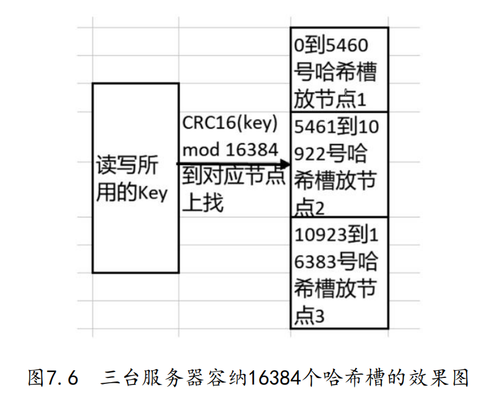
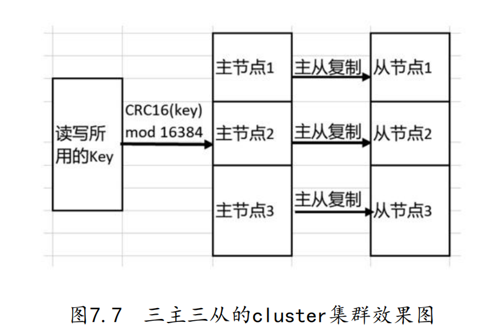

# 7.3 搭建cluster集群

因为cluster的中文翻译是"集群",所以在一些资料里会把此处提到的cluster集群称为Redis集群.从广义上来讲,只要两台服务器之间有关联,它们就可以构成一个集群,所以在前文里把由"一主二从"和"哨兵节点加一主二从"等构成的系统称为"集群".这里为了避免混淆,将提到的集群称为cluster集群

**相比于哨兵模式,cluster集群能支持扩容,且无须额外的节点来监控状态,所以使用这种模式集群的系统会用得更多些**

## 7.3.1 哈希槽与cluster集群

在cluster集群中,有16384个哈希槽(hash slot),在设置Redis的键(key)时,会先用CRC16算法对key运算,然后使用16384对这个结果取模,取模的结果是多少,就把这个key放到该结果锁编号的哈希槽中.数学算法如下所示,其中`slotIndex`表示该key所存放的槽的编号

```

slotIndex = HASH_SLOT = CRC16(key) mod 16384

```

****

Redis Cluster使用16384作为哈希槽的数量,因为它是一个相对小而合理的数值,可以在集群的各个节点之间实现均衡的数据分配,同时保持管理和重新分片的复杂性在可接受的范围内.

选择16384的几个原因如下:

1. **性能和管理的平衡**:选择一个太小的哈希槽数可能会导致数据分布不均匀.相反,选择一个太大的哈希槽数会增加管理的复杂性,例如在节点之间迁移哈希槽时.16384提供了一个合适的中间值

2. **分片和迁移**:当需要将哈希槽从一个节点迁移到另一个节点时(例如当添加或删除集群节点时),较小的哈希槽数意味着每个槽可能包含更多的键,这会使迁移操作更加耗时.16384个哈希槽提供了更细粒度的数据分片,从而使得单个哈希槽的迁移成为一个相对快速的操作

3. **历史和常规选择**:这也可能是基于经验和其他分布式系统的常见实践.例如,一些其他的系统或数据库也可能使用类似的哈希槽或分区数量

4. **二进制因子**:16384是2^14.在计算机科学中,使用2的幂是很常见的,因为它们在计算上是高效的

总之,16384是一个经过权衡后的选择,它在分布均匀性、管理的复杂性和操作效率之间达到了一个平衡

****

比如某cluster集群由三台Redis服务器组成,那么编号从0到5460号哈希槽会被分配到第一台Redis服务器,5461到10922号哈希槽会被分配到第二台服务器,10923到16383号哈希槽会被分配到第三台服务器上,如下图示:



同理,如果某cluster集群是由六台Redis服务器组成的,那么每台服务器上也会被平均分配一定数量的哈希槽.此外,cluster集群里也支持主从复制模式,即分配到一定数量哈希槽的Redis服务器也可以携带一个或多个从节点.下图为包含三主三从的cluster集群的效果:



## 7.3.2 初步搭建cluster集群

### a. 编写配置文件

- step1. 编写redisClusterMaster1的配置文件

```
(base) root@yuanhong section7-3 % cat clusterMaster1.conf 
# 指定default用户的密码 允许执行所有命令 允许访问所有key 允许访问所有频道
user default on >default_password ~* &* +@all

# 指定用户名和密码 允许执行所有命令 允许访问所有key 允许访问所有频道
user cluster_user on >cluster_password ~* &* +@all

# 指定端口
port 6379

# 指定文件写入的目录
dir "/StudyRedisBaseOnDocker/conf/chapter7/section7-3/logs"

# 指定日志文件名
logfile "clusterMaster1.log"

# 指定开启cluster集群模式
cluster-enabled yes

# 指定自动生成的cluster集群相关配置文件的文件名
cluster-config-file nodes-6379.conf
```

- step2. 编写redisClusterMaster2的配置文件

```
(base) root@yuanhong section7-3 % cat clusterMaster2.conf 
# 指定default用户的密码 允许执行所有命令 允许访问所有key 允许访问所有频道
user default on >default_password ~* &* +@all

# 指定用户名和密码 允许执行所有命令 允许访问所有key 允许访问所有频道
user cluster_user on >cluster_password ~* &* +@all

# 指定端口
port 6380

# 指定文件写入的目录
dir "/StudyRedisBaseOnDocker/conf/chapter7/section7-3/logs"

# 指定日志文件名
logfile "clusterMaster2.log"

# 指定开启cluster集群模式
cluster-enabled yes

# 指定自动生成的cluster集群相关配置文件的文件名
cluster-config-file nodes-6380.conf
```

- step3. 编写redisClusterMaster3的配置文件

```
(base) root@yuanhong section7-3 % cat clusterMaster3.conf 
# 指定default用户的密码 允许执行所有命令 允许访问所有key 允许访问所有频道
user default on >default_password ~* &* +@all

# 指定用户名和密码 允许执行所有命令 允许访问所有key 允许访问所有频道
user cluster_user on >cluster_password ~* &* +@all

# 指定端口
port 6381

# 指定文件写入的目录
dir "/StudyRedisBaseOnDocker/conf/chapter7/section7-3/logs"

# 指定日志文件名
logfile "clusterMaster3.log"

# 指定开启cluster集群模式
cluster-enabled yes

# 指定自动生成的cluster集群相关配置文件的文件名
cluster-config-file nodes-6381.conf
```

- step4. 编写clusterSlave1的配置文件


```
(base) root@yuanhong section7-3 % cat clusterSlave1.conf 
# 指定default用户的密码 允许执行所有命令 允许访问所有key 允许访问所有频道
user default on >default_password ~* &* +@all

# 指定用户名和密码 允许执行所有命令 允许访问所有key 允许访问所有频道
user cluster_user on >cluster_password ~* &* +@all

# 指定端口
port 26379

# 指定文件写入的目录
dir "/StudyRedisBaseOnDocker/conf/chapter7/section7-3/logs"

# 指定日志文件名
logfile "clusterSlave1.log"

# 指定开启cluster集群模式
cluster-enabled yes

# 指定自动生成的cluster集群相关配置文件的文件名
cluster-config-file nodes-26379.conf
```

注:此处并没有在配置文件中配置主从关系,后续步骤中会设置主从关系

- step5. 编写clusterSlave2的配置文件

```
(base) root@yuanhong section7-3 % cat clusterSlave2.conf
# 指定default用户的密码 允许执行所有命令 允许访问所有key 允许访问所有频道
user default on >default_password ~* &* +@all

# 指定用户名和密码 允许执行所有命令 允许访问所有key 允许访问所有频道
user cluster_user on >cluster_password ~* &* +@all

# 指定端口
port 26380

# 指定文件写入的目录
dir "/StudyRedisBaseOnDocker/conf/chapter7/section7-3/logs"

# 指定日志文件名
logfile "clusterSlave2.log"

# 指定开启cluster集群模式
cluster-enabled yes

# 指定自动生成的cluster集群相关配置文件的文件名
cluster-config-file nodes-26380.conf
```

- step6. 编写clusterSlave3的配置文件

```
(base) root@yuanhong section7-3 % cat clusterSlave3.conf
# 指定default用户的密码 允许执行所有命令 允许访问所有key 允许访问所有频道
user default on >default_password ~* &* +@all

# 指定用户名和密码 允许执行所有命令 允许访问所有key 允许访问所有频道
user cluster_user on >cluster_password ~* &* +@all

# 指定端口
port 26381

# 指定文件写入的目录
dir "/StudyRedisBaseOnDocker/conf/chapter7/section7-3/logs"

# 指定日志文件名
logfile "clusterSlave3.log"

# 指定开启cluster集群模式
cluster-enabled yes

# 指定自动生成的cluster集群相关配置文件的文件名
cluster-config-file nodes-26381.conf
```

可以看到,和搭建主从模式的集群一样,也是要求集群中所有节点的用户名和密码一致

### b. 启动节点

- step1. 启动clusterMaster1节点

```
(base) root@yuanhong ~ % redis-server /StudyRedisBaseOnDocker/conf/chapter7/section7-3/clusterMaster1.conf
```

- step2. 启动clusterMaster2节点

```
(base) root@yuanhong ~ % redis-server /StudyRedisBaseOnDocker/conf/chapter7/section7-3/clusterMaster2.conf
```

- step3. 启动clusterMaster3节点

```
(base) root@yuanhong ~ % redis-server /StudyRedisBaseOnDocker/conf/chapter7/section7-3/clusterMaster3.conf
```

- step4. 启动clusterSlave1节点

```
(base) root@yuanhong ~ % redis-server /StudyRedisBaseOnDocker/conf/chapter7/section7-3/clusterSlave1.conf
```

- step5. 启动clusterSlave2节点

```
(base) root@yuanhong ~ % redis-server /StudyRedisBaseOnDocker/conf/chapter7/section7-3/clusterSlave2.conf
```

- step6. 启动clusterSlave3节点

```
(base) root@yuanhong ~ % redis-server /StudyRedisBaseOnDocker/conf/chapter7/section7-3/clusterSlave3.conf
```

### c. 查看配置文件

- step1. 查看nodes-6379.conf

```
(base) root@yuanhong logs % cat nodes-6379.conf 
351a708157443107901867c29bb9b15f4a97d982 :0@0 myself,master - 0 0 0 connected
vars currentEpoch 0 lastVoteEpoch 0
```

其中:

- `myself,master`:表示该节点属于master节点,且只连接到myself自身,没有同其他Redis节点关联


- step2. 查看nodes-6380.conf

```
(base) root@yuanhong logs % cat nodes-6380.conf 
41cc395f669224ace3ffea9c303a91133e6d2d1b :0@0 myself,master - 0 0 0 connected
vars currentEpoch 0 lastVoteEpoch 0
```

- step3. 查看nodes-6381.conf

```
(base) root@yuanhong logs % cat nodes-6381.conf
0daaf91c7e5f1e86201681657aa4ccfef924a6a4 :0@0 myself,master - 0 0 0 connected
vars currentEpoch 0 lastVoteEpoch 0
```

- step4. 查看nodes-26379.conf

```
(base) root@yuanhong logs % cat nodes-26379.conf 
35aff0967d6acf83b3c8aa162ee0ecf672c35d77 :0@0 myself,master - 0 0 0 connected
vars currentEpoch 0 lastVoteEpoch 0
```

- step5. 查看nodes-26380.conf

```
(base) root@yuanhong logs % cat nodes-26380.conf
fedc556590df33b8475f03577f71567d0aed53c5 :0@0 myself,master - 0 0 0 connected
vars currentEpoch 0 lastVoteEpoch 0
```

- step6. 查看nodes-26381.conf

```
(base) root@yuanhong logs % cat nodes-26381.conf
e32c99aa8333002891153fd2144cfa63302e53b0 :0@0 myself,master - 0 0 0 connected
vars currentEpoch 0 lastVoteEpoch 0
```

可以看到,此时各个节点都没有互相关联

### d. 关联各个节点

```
(base) root@192 ~ % redis-cli -h 127.0.0.1 -p 6379
127.0.0.1:6379> AUTH cluster_user cluster_password
OK
127.0.0.1:6379> CLUSTER MEET 127.0.0.1 6380
OK
127.0.0.1:6379> CLUSTER MEET 127.0.0.1 6381
OK
127.0.0.1:6379> CLUSTER MEET 127.0.0.1 26379
OK
127.0.0.1:6379> CLUSTER MEET 127.0.0.1 26380
OK
127.0.0.1:6379> CLUSTER MEET 127.0.0.1 26381
OK
```

`CLUSTER MEET`命令用于向Redis Cluster节点引入新的节点.这是集群扩展或修改时的基本操作.以下是命令的功能和使用场景的详细描述:

#### 功能

当你执行`CLUSTER MEET`命令时,你实际上是在告诉一个现有的Redis Cluster节点去与另一个Redis节点(可能是新的节点)进行通信并建立连接

具体来说,执行此命令后:

1. 指定的现有节点(通常称为目标节点)将尝试与新节点建立连接

2. 一旦连接建立,两个节点将交换集群配置信息,并开始周期性地彼此同步

3. 新节点将被引入到集群网络中,但此时它可能还没有承担任何哈希槽的责任.为了使其成为集群的功能性部分,您可能需要进一步分配哈希槽或从其他节点迁移哈希槽

#### 使用场景

1. **扩展集群**:当你想要向现有的Redis Cluster添加更多节点以增加容量或提供更高的可用性时,您会使用此命令

2. **集群维护**:如果某个节点出现故障并且需要被替换,或者您只是想要重新配置集群的节点布局,你也可能会使用此命令

3. **初次设置集群**:在初次创建Redis Cluster时,您需要使用`meet`命令将所有节点连接在一起

```bash
CULSTER MEET <existing-node-ip> <existing-node-port> <new-node-ip> <new-node-port>
```

其中:

- `existing-node-ip`:现有节点的IP
- `existing-node-port`:现有节点的端口
- `new-node-ip`:要引入的新节点的IP
- `new-node-port`:要引入的新节点的端口

查看集群情况:

```
127.0.0.1:6379> CLUSTER INFO
cluster_state:fail
cluster_slots_assigned:0
cluster_slots_ok:0
cluster_slots_pfail:0
cluster_slots_fail:0
cluster_known_nodes:6
cluster_size:0
cluster_current_epoch:5
cluster_my_epoch:1
cluster_stats_messages_ping_sent:73
cluster_stats_messages_pong_sent:88
cluster_stats_messages_meet_sent:5
cluster_stats_messages_sent:166
cluster_stats_messages_ping_received:88
cluster_stats_messages_pong_received:78
cluster_stats_messages_received:166
```

- `cluster_known_nodes`:当前cluster集群中有6个节点
- `cluster_state`:目前集群处于fail状态,因为还没有给集群中的节点分配哈希槽

### e. 分配哈希槽

为3个主节点分配哈希槽,其命令语法如下:

- `CLUSTER ADDSLOTS`:是Redis Cluster的一个命令,用于将一个或多个哈希槽分配给当前节点.这是构建Redis Cluster时的一个重要步骤,因为它决定了哪些键被存储在哪个节点

该命令的基本语法如下：

```
CLUSTER ADDSLOTS slot [slot ...]
```

其中:

- `slot`:是一个介于0到16383之间的数字,代表一个哈希槽

需要注意的是,一旦一个哈希槽被分配给一个节点,它不能被重新分配给另一个节点,除非你首先使用`CLUSTER DELSLOTS`命令从原始节点中删除它

redis-cli -h <your-hostname-or-ip> -p <your-port> -a "<your-username>:<your-password>"


此处逐个添加slot不太现实,所以采用shell中的范围表示法来添加:

```
redis-cli -h <node-ip> -p <node-port> -a "<your-username>:<your-password>" CLUSTER ADDSLOTS <slot1> [slot2] ... [slotN]
```

- `node-ip`:要分配哈希槽的Redis Cluster节点的IP 地址
- `node-port`:要分配哈希槽的Redis Cluster节点的端口
- `<slot1> [slot2] ... [slotN]`:要分配给该节点的哈希槽的编号

例如:想要为IP为192.168.1.10、端口为7000的节点分配哈希槽1到5000,可以按如下写法:

```
redis-cli -h 192.168.1.10 -p 7000 CLUSTER ADDSLOTS {1..5000}
```

- step1. 分配哈希槽给3个主节点

```
(base) root@192 ~ % redis-cli -h 127.0.0.1 -p 6379 --user cluster_user --pass cluster_password CLUSTER ADDSLOTS {0..5460}
Warning: Using a password with '-a' or '-u' option on the command line interface may not be safe.
OK
```

```
(base) root@192 ~ % redis-cli -h 127.0.0.1 -p 6380 --user cluster_user --pass cluster_password CLUSTER ADDSLOTS {5461..10922}
Warning: Using a password with '-a' or '-u' option on the command line interface may not be safe.
OK
```

```
(base) root@192 ~ % redis-cli -h 127.0.0.1 -p 6381 --user cluster_user --pass cluster_password CLUSTER ADDSLOTS {10923..16383}
Warning: Using a password with '-a' or '-u' option on the command line interface may not be safe.
OK
```

- step2. 查看当前集群情况

```
(base) root@192 ~ % redis-cli -p 6379
127.0.0.1:6379> AUTH cluster_user cluster_password
OK
127.0.0.1:6379> CLUSTER INFO
cluster_state:ok
cluster_slots_assigned:16384
cluster_slots_ok:16384
cluster_slots_pfail:0
cluster_slots_fail:0
cluster_known_nodes:6
cluster_size:3
cluster_current_epoch:5
cluster_my_epoch:1
cluster_stats_messages_ping_sent:1490
cluster_stats_messages_pong_sent:1586
cluster_stats_messages_meet_sent:5
cluster_stats_messages_sent:3081
cluster_stats_messages_ping_received:1586
cluster_stats_messages_pong_received:1495
cluster_stats_messages_received:3081
```

可以看到,此时集群状态为正常,且已经有16384个哈希槽被分配到了该集群中.

### f. 设置从节点

- step1. 查看节点ID

- `CLUSTER REPLICATE nodeID`:设置当前节点为指定节点的从节点

命令`CLUSTER NODES`可用于查看节点ID

```
127.0.0.1:6379> CLUSTER NODES
dda36b27b4e0ed367b3267a565ed327fcda1f0e8 127.0.0.1:6380@16380 master - 0 1692281228000 0 connected 5461-10922
6983a0e89974c9fc1714061e7d3773cf614bd5bf 127.0.0.1:26380@36380 master - 0 1692281229652 4 connected
5415f296bb4de9a01f30f7e15a91845096ff5265 127.0.0.1:26379@36379 master - 0 1692281227000 3 connected
11e718918a9c689ed80bca73e3c24d9f2bb34102 127.0.0.1:6381@16381 master - 0 1692281227000 2 connected 10923-16383
482dc2ec344c3b2997b5bd6063c48d5f1a222014 127.0.0.1:26381@36381 master - 0 1692281228644 5 connected
c182e10b7f26e1289f6aa4fd41ac707ec3319508 127.0.0.1:6379@16379 myself,master - 0 1692281228000 1 connected 0-5460
```

其中第1列即为节点ID

即:

- clusterMaster1的节点ID为:c182e10b7f26e1289f6aa4fd41ac707ec3319508
- clusterMaster2的节点ID为:dda36b27b4e0ed367b3267a565ed327fcda1f0e8
- clusterMaster2的节点ID为:11e718918a9c689ed80bca73e3c24d9f2bb34102

- step2. 设置clusterSlave1节点为clusterMaster1的从节点

```
(base) root@192 ~ % redis-cli -h 127.0.0.1 -p 26379
127.0.0.1:26379> AUTH cluster_user cluster_password
OK
127.0.0.1:26379> ACL WHOAMI
"cluster_user"
127.0.0.1:26379> CLUSTER REPLICATE c182e10b7f26e1289f6aa4fd41ac707ec3319508
OK
```

- step3. 设置clusterSlave2节点为clusterMaster2的从节点

```
(base) root@192 ~ % redis-cli -h 127.0.0.1 -p 26380
127.0.0.1:26380> AUTH cluster_user cluster_password
OK
127.0.0.1:26380> ACL WHOAMI
"cluster_user"
127.0.0.1:26380> CLUSTER REPLICATE dda36b27b4e0ed367b3267a565ed327fcda1f0e8
OK
```

- step4. 设置clusterSlave3节点为clusterMaster3的从节点

```
(base) root@192 ~ % redis-cli -h 127.0.0.1 -p 26381
127.0.0.1:26381> AUTH cluster_user cluster_password
OK
127.0.0.1:26381> ACL WHOAMI
"cluster_user"
127.0.0.1:26381> CLUSTER REPLICATE 11e718918a9c689ed80bca73e3c24d9f2bb34102
OK
```

- step5. 在任一节点上查看集群节点情况

```
127.0.0.1:26381> CLUSTER NODES 
5415f296bb4de9a01f30f7e15a91845096ff5265 127.0.0.1:26379@36379 slave c182e10b7f26e1289f6aa4fd41ac707ec3319508 0 1692281820368 1 connected
6983a0e89974c9fc1714061e7d3773cf614bd5bf 127.0.0.1:26380@36380 slave dda36b27b4e0ed367b3267a565ed327fcda1f0e8 0 1692281820000 0 connected
dda36b27b4e0ed367b3267a565ed327fcda1f0e8 127.0.0.1:6380@16380 master - 0 1692281819364 0 connected 5461-10922
11e718918a9c689ed80bca73e3c24d9f2bb34102 127.0.0.1:6381@16381 master - 0 1692281821526 2 connected 10923-16383
482dc2ec344c3b2997b5bd6063c48d5f1a222014 127.0.0.1:26381@36381 myself,slave 11e718918a9c689ed80bca73e3c24d9f2bb34102 0 1692281819000 2 connected
c182e10b7f26e1289f6aa4fd41ac707ec3319508 127.0.0.1:6379@16379 master - 0 1692281819000 1 connected 0-5460
```

可以看到,目前是3主3从的状态了

## 7.3.3 在cluster集群中读写数据

在任一从节点上执行写入操作,触发写入错误:

```
(base) root@192 ~ % redis-cli -h 127.0.0.1 -p 26379
127.0.0.1:26379> AUTH cluster_user cluster_password
OK
127.0.0.1:26379> SET name 'Peter'
(error) MOVED 5798 127.0.0.1:6380
```

可以看到,其实并不是写入操作失败了,报错信息表明写入的键被移动到了`127.0.0.1:6380`的低5798个哈希槽中.在操作中,用户希望是透明地进行数据的读写操作,而不希望看到此类的读写错误

为了达到这个效果,需要在`redis-cli`命令后加入`-c`参数,以实现互联的效果:

```
(base) root@192 ~ % redis-cli -h 127.0.0.1 -p 26379 -c --user cluster_user --pass cluster_password
Warning: Using a password with '-a' or '-u' option on the command line interface may not be safe.
127.0.0.1:26379> SET name 'Peter'
-> Redirected to slot [5798] located at 127.0.0.1:6380
OK
```

注意:在redis cluster的集群下,必须在连接时使用`--user`和`--pass`指定用户名密码,才能在执行命令时不报错.当然,集群中各节点的用户名密码应相同.否则报错如下:

```
(base) root@192 ~ % redis-cli -h 127.0.0.1 -p 26379 -c
127.0.0.1:26379> AUTH cluster_user cluster_password
OK
127.0.0.1:26379> SET name 'Peter'
-> Redirected to slot [5798] located at 127.0.0.1:6380
(error) NOAUTH Authentication required.
(0.50s)
```

读取:

```
(base) root@192 ~ % redis-cli -h 127.0.0.1 -p 26380 -c --user cluster_user --pass cluster_password
Warning: Using a password with '-a' or '-u' option on the command line interface may not be safe.
127.0.0.1:26380> GET name
-> Redirected to slot [5798] located at 127.0.0.1:6380
"Peter"
```

## 7.3.4 模拟扩容和数据迁移动作

扩容1主1从:

- step1. 编写clusterMasterNew.conf文件

```
(base) root@192 section7-3 % cat clusterMasterNew.conf 
# 指定default用户的密码 允许执行所有命令 允许访问所有key 允许访问所有频道
user default on >default_password ~* &* +@all

# 指定用户名和密码 允许执行所有命令 允许访问所有key 允许访问所有频道
user cluster_user on >cluster_password ~* &* +@all

# 指定端口
port 6385

# 指定文件写入的目录
dir "/StudyRedisBaseOnDocker/conf/chapter7/section7-3/logs"

# 指定日志文件名
logfile "clusterMasterNew.log"

# 指定开启cluster集群模式
cluster-enabled yes

# 指定自动生成的cluster集群相关配置文件的文件名
cluster-config-file nodes-6385.conf
```

- step2. 启动clusterMasterNew节点

```
(base) root@192 section7-3 % redis-server /StudyRedisBaseOnDocker/conf/chapter7/section7-3/clusterMasterNew.conf 
```

- step3. 编写clusterSlaveNew.conf文件

```
(base) root@192 section7-3 % cat clusterSlaveNew.conf 
# 指定default用户的密码 允许执行所有命令 允许访问所有key 允许访问所有频道
user default on >default_password ~* &* +@all

# 指定用户名和密码 允许执行所有命令 允许访问所有key 允许访问所有频道
user cluster_user on >cluster_password ~* &* +@all

# 指定端口
port 26385

# 指定文件写入的目录
dir "/StudyRedisBaseOnDocker/conf/chapter7/section7-3/logs"

# 指定日志文件名
logfile "clusterSlaveNew.log"

# 指定开启cluster集群模式
cluster-enabled yes

# 指定自动生成的cluster集群相关配置文件的文件名
cluster-config-file nodes-26385.conf
```

- step4. 启动clusterSlaveNew节点

```
(base) root@192 section7-3 % redis-server /StudyRedisBaseOnDocker/conf/chapter7/section7-3/clusterSlaveNew.conf
```

- step5. 将clusterMasterNew节点和clusterSlaveNew节点加入集群

```
(base) root@192 ~ % redis-cli -h 127.0.0.1 -p 6379       
127.0.0.1:6379> AUTH cluster_user cluster_password
OK
127.0.0.1:6379> CLUSTER MEET 127.0.0.1 6385
OK
127.0.0.1:6379> CLUSTER MEET 127.0.0.1 26385
OK
```

- step6. 在clusterSlaveNew节点设置其对应的主节点

查看节点ID:

```
(base) root@192 ~ % redis-cli -h 127.0.0.1 -p 26385
127.0.0.1:26385> AUTH cluster_user cluster_password
OK
127.0.0.1:26385> CLUSTER NODES
5415f296bb4de9a01f30f7e15a91845096ff5265 127.0.0.1:26379@36379 slave c182e10b7f26e1289f6aa4fd41ac707ec3319508 0 1692283204043 1 connected
b65229a1d68aabf96ad488fe4115814167afbeec 127.0.0.1:6385@16385 master - 0 1692283203000 6 connected
6983a0e89974c9fc1714061e7d3773cf614bd5bf 127.0.0.1:26380@36380 slave dda36b27b4e0ed367b3267a565ed327fcda1f0e8 0 1692283199000 0 connected
482dc2ec344c3b2997b5bd6063c48d5f1a222014 127.0.0.1:26381@36381 slave 11e718918a9c689ed80bca73e3c24d9f2bb34102 0 1692283202000 2 connected
dda36b27b4e0ed367b3267a565ed327fcda1f0e8 127.0.0.1:6380@16380 master - 0 1692283203029 0 connected 5461-10922
11e718918a9c689ed80bca73e3c24d9f2bb34102 127.0.0.1:6381@16381 master - 0 1692283201000 2 connected 10923-16383
c182e10b7f26e1289f6aa4fd41ac707ec3319508 127.0.0.1:6379@16379 master - 0 1692283201000 1 connected 0-5460
cee8de80721938454744c1604188da8db22c841e 127.0.0.1:26385@36385 myself,master - 0 1692283200000 7 connected
```

可以看到,`b65229a1d68aabf96ad488fe4115814167afbeec`为clusterMasterNew的节点ID

设置主从:

```
127.0.0.1:26385> CLUSTER REPLICATE b65229a1d68aabf96ad488fe4115814167afbeec
OK
```

查看设置结果:

```
127.0.0.1:26385> CLUSTER NODES
5415f296bb4de9a01f30f7e15a91845096ff5265 127.0.0.1:26379@36379 slave c182e10b7f26e1289f6aa4fd41ac707ec3319508 0 1692283243000 1 connected
b65229a1d68aabf96ad488fe4115814167afbeec 127.0.0.1:6385@16385 master - 0 1692283241000 6 connected
6983a0e89974c9fc1714061e7d3773cf614bd5bf 127.0.0.1:26380@36380 slave dda36b27b4e0ed367b3267a565ed327fcda1f0e8 0 1692283243261 0 connected
482dc2ec344c3b2997b5bd6063c48d5f1a222014 127.0.0.1:26381@36381 slave 11e718918a9c689ed80bca73e3c24d9f2bb34102 0 1692283244267 2 connected
dda36b27b4e0ed367b3267a565ed327fcda1f0e8 127.0.0.1:6380@16380 master - 0 1692283245908 0 connected 5461-10922
11e718918a9c689ed80bca73e3c24d9f2bb34102 127.0.0.1:6381@16381 master - 0 1692283243000 2 connected 10923-16383
c182e10b7f26e1289f6aa4fd41ac707ec3319508 127.0.0.1:6379@16379 master - 0 1692283244000 1 connected 0-5460
cee8de80721938454744c1604188da8db22c841e 127.0.0.1:26385@36385 myself,slave b65229a1d68aabf96ad488fe4115814167afbeec 0 1692283240000 6 connected
```

- step7. 重新分片

```
(base) root@192 ~ % redis-cli --cluster reshard 127.0.0.1:6379 --cluster-from c182e10b7f26e1289f6aa4fd41ac707ec3319508,dda36b27b4e0ed367b3267a565ed327fcda1f0e8,11e718918a9c689ed80bca73e3c24d9f2bb34102 --cluster-to b65229a1d68aabf96ad488fe4115814167afbeec --cluster-slots 1024 --user cluster_user --pass cluster_password
```

其中:

- `127.0.0.1:6379`:指定执行重新分配哈希槽命令的redis服务器
- `--cluster-from`:指定要迁出哈希槽的节点ID,多个节点ID由`,`分割
- `--cluster-to`:指定要迁入的节点ID
- `--cluster-slots`:指定要迁移的哈希槽数量.此处的数量是指总数,而非是每个节点上的哈希槽数量

执行结果:

```
>>> Performing Cluster Check (using node 127.0.0.1:6379)
M: c182e10b7f26e1289f6aa4fd41ac707ec3319508 127.0.0.1:6379
   slots:[0-5460] (5461 slots) master
   1 additional replica(s)
S: cee8de80721938454744c1604188da8db22c841e 127.0.0.1:26385
   slots: (0 slots) slave
   replicates b65229a1d68aabf96ad488fe4115814167afbeec
M: dda36b27b4e0ed367b3267a565ed327fcda1f0e8 127.0.0.1:6380
   slots:[5461-10922] (5462 slots) master
   1 additional replica(s)
S: 6983a0e89974c9fc1714061e7d3773cf614bd5bf 127.0.0.1:26380
   slots: (0 slots) slave
   replicates dda36b27b4e0ed367b3267a565ed327fcda1f0e8
S: 5415f296bb4de9a01f30f7e15a91845096ff5265 127.0.0.1:26379
   slots: (0 slots) slave
   replicates c182e10b7f26e1289f6aa4fd41ac707ec3319508
M: 11e718918a9c689ed80bca73e3c24d9f2bb34102 127.0.0.1:6381
   slots:[10923-16383] (5461 slots) master
   1 additional replica(s)
S: 482dc2ec344c3b2997b5bd6063c48d5f1a222014 127.0.0.1:26381
   slots: (0 slots) slave
   replicates 11e718918a9c689ed80bca73e3c24d9f2bb34102
M: b65229a1d68aabf96ad488fe4115814167afbeec 127.0.0.1:6385
   slots: (0 slots) master
   1 additional replica(s)
[OK] All nodes agree about slots configuration.
>>> Check for open slots...
>>> Check slots coverage...
[OK] All 16384 slots covered.
```

确认迁移后:

```
	Moving slot 5461 from dda36b27b4e0ed367b3267a565ed327fcda1f0e8
    Moving slot 5462 from dda36b27b4e0ed367b3267a565ed327fcda1f0e8
    ...
    Moving slot 0 from c182e10b7f26e1289f6aa4fd41ac707ec3319508
    Moving slot 1 from c182e10b7f26e1289f6aa4fd41ac707ec3319508
    ...
    Moving slot 10923 from 11e718918a9c689ed80bca73e3c24d9f2bb34102
    Moving slot 10924 from 11e718918a9c689ed80bca73e3c24d9f2bb34102
    ...
```

- step8. 查看集群情况

```
(base) root@192 ~ % redis-cli -h 127.0.0.1 -p 6380
127.0.0.1:6380> AUTH cluster_user cluster_password
OK
127.0.0.1:6380> CLUSTER INFO
cluster_state:ok
cluster_slots_assigned:16384
cluster_slots_ok:16384
cluster_slots_pfail:0
cluster_slots_fail:0
cluster_known_nodes:8
cluster_size:4
cluster_current_epoch:8
cluster_my_epoch:0
cluster_stats_messages_ping_sent:4858
cluster_stats_messages_pong_sent:4420
cluster_stats_messages_sent:9278
cluster_stats_messages_ping_received:4419
cluster_stats_messages_pong_received:5195
cluster_stats_messages_meet_received:1
cluster_stats_messages_received:9615
```

- `cluster_size:4`:表示集群大小.由于当前该cluster集群包含了4个主节点和4个从节点,而哈希槽是分散在了4个主节点上,所以集群大小为4

查看节点情况:

```
(base) root@192 ~ % redis-cli -h 127.0.0.1 -p 6385
127.0.0.1:6385> AUTH cluster_user cluster_password
OK
127.0.0.1:6385> CLUSTER NODES
011cf3137a08205c6459dbf2290451fa8c8d309b 127.0.0.1:6380@16380 master - 0 1692286241000 1 connected 6140-10922
4a805531f0b36880faf746a9e0d6796643ce4c99 127.0.0.1:26385@36385 slave fa5c791946ce5cee2cbde002f5a7e2fe13e70f55 0 1692286241000 7 connected
17b7a1ce43fa31ac5849bad7fc812614fc15abbd 127.0.0.1:26381@36381 slave 26f4ec73c65682d8db5e77ec3b37132f2bcdd99c 1692286243529 1692286239000 2 connected
fa5c791946ce5cee2cbde002f5a7e2fe13e70f55 127.0.0.1:6385@16385 myself,master - 0 1692286236000 7 connected 0-689 5461-6139 10923-11611
77c23e662bcb6219564e1b30509d2611a54cb029 127.0.0.1:6379@16379 master - 1692286244535 1692286240000 4 connected 690-5460
26f4ec73c65682d8db5e77ec3b37132f2bcdd99c 127.0.0.1:6381@16381 master - 0 1692286242521 2 connected 11612-16383
2c00aa4baa17f1c4a25cdd2b4ff9084419a7cd09 127.0.0.1:26379@36379 slave 77c23e662bcb6219564e1b30509d2611a54cb029 0 1692286241000 4 connected
7edf9234b5524b3a8ef3442667bf8646fef12b67 127.0.0.1:26380@36380 slave 011cf3137a08205c6459dbf2290451fa8c8d309b 0 1692286241520 1 connected
```

## 7.3.5 cluster集群的常用配置参数

- `cluster-enabled`:表示Redis节点是否支持cluster集群.取值是`yes`表示支持集群;取值是`no`表示以普通Redis服务器节点的方式启动

- `cluster-config-file`:指定cluster集群配置文件的名称.该配置文件不是由使用者创建或更改的,而是在Redis服务器第一次以cluster节点身份启动时自动生
成的.在该文件中保存了cluster集群里本节点和其他节点的信息和关联方式

- `cluster-require-full-coverage`:表示当cluster集群中有节点失效时,该集群是否继续对外提供写服务.出于1容错性考虑,建议该参数值设置为`no`.若设置为`yes`,则集群中有节点失效时,该集群只能提供读服务

- `cluster-node-timeout`:用于设置cluster集群中节点的最长不可用时间(单位:毫秒).如果主节点的不可用时间超过该参数指定的值,那么会向对应的从节点进行故障转移动作

- `cluster-migration-barrier`:用于设置主节点的最小从节点数量.假设该值设置为1，当某主节点的从节点个数小于1时,就会从其他从节点个数大于1的主节点那边调剂一个从节点过来.这样做的目的是避免出现不包含从节点的主节点,因为一旦出现这种情况,当主节点失效后,就无法再用从节点进行故障恢复的动作.也就是说,合理地设置该参数能提升cluster集群系统的可靠性