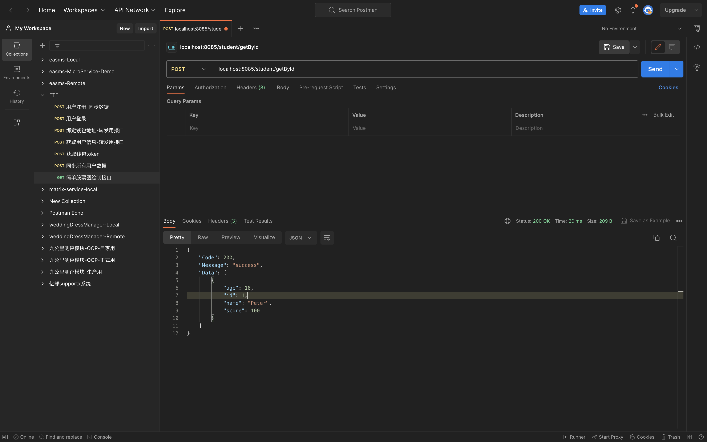
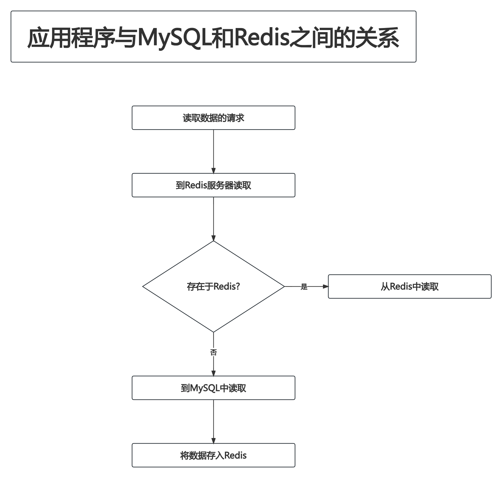
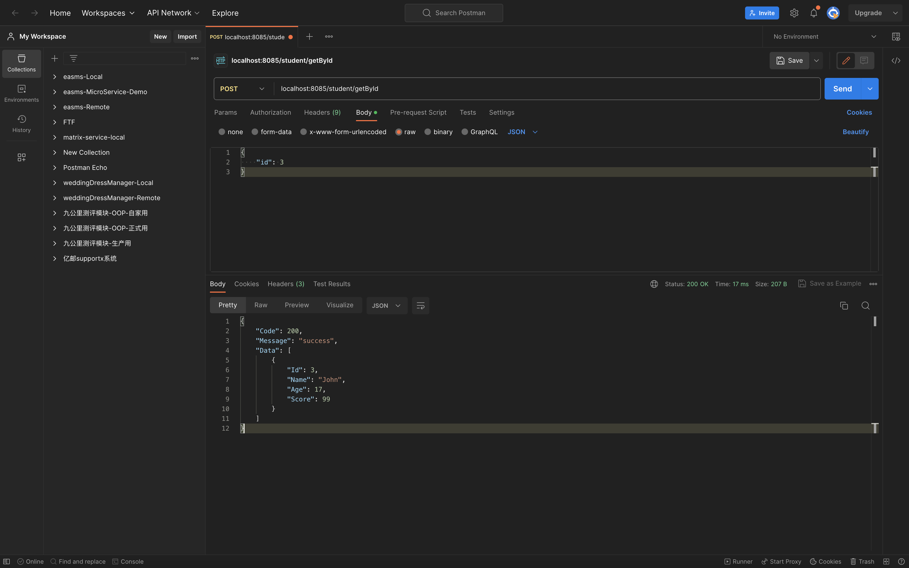
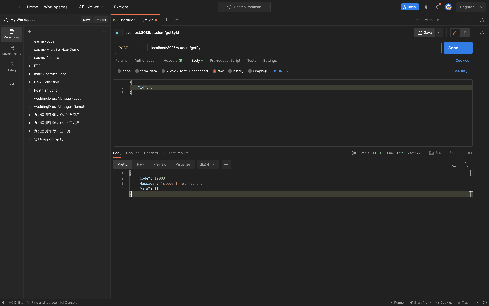

# 8.3 Redis与MySQL的整合

## 8.3.1 通过Docker安装MySQL开发环境

此处我直接用的本地MySQL.DDL语句如下:

```SQL
CREATE TABLE `student` (
  `id` int(11) unsigned NOT NULL AUTO_INCREMENT,
  `name` varchar(255) DEFAULT NULL,
  `age` int(11) DEFAULT NULL,
  `score` float DEFAULT NULL,
  `created_at` datetime DEFAULT CURRENT_TIMESTAMP,
  `updated_at` datetime DEFAULT CURRENT_TIMESTAMP ON UPDATE CURRENT_TIMESTAMP,
  PRIMARY KEY (`id`)
) ENGINE=InnoDB DEFAULT CHARSET=utf8;
```

DML语句如下:

```SQL
INSERT INTO `student` (`id`, `name`, `age`, `score`, `created_at`, `updated_at`)
VALUES
	(1,'Peter',18,100,'2023-08-23 14:10:16','2023-08-23 14:10:16'),
	(2,'Tom',17,98,'2023-08-23 14:10:27','2023-08-23 14:10:27'),
	(3,'John',17,99,'2023-08-23 14:10:38','2023-08-23 14:10:38');
```

## 8.3.2 通过GORM连接并操作MySQL数据库

本例中使用GIN + GORM + REDIGO这3个库来完成演示

### 8.3.2.1 初始化连接

工程结构如下:

```
(base) yanglei@yuanhong mysqlAndRedis % tree ./
./
├── cache
│   ├── conf.go
│   └── conn.go
├── db
│   ├── conf.go
│   └── conn.go
├── go.mod
├── go.sum
└── main.go

2 directories, 7 files
```

`cache/conf.go`:

```go
package cache

// Conf redis相关配置
type Conf struct {
	// NetWork 网络类型
	NetWork string
	// Address Redis地址 格式: ip:port
	Address string
	// User 用户名
	User string
	// Password 密码
	Password string
}
```

`cache/conn.go`:

```go
package cache

import (
	"github.com/gomodule/redigo/redis"
)

var Conn redis.Conn

// Connect 根据给定的配置 创建Redis连接
func Connect(conf Conf) (err error) {
	if Conn != nil {
		return nil
	}

	// 连接到Redis
	Conn, err = redis.Dial(conf.NetWork, conf.Address)
	if err != nil {
		return err
	}

	if conf.User != "" || conf.Password != "" {
		err = auth(conf, Conn)
		if err != nil {
			return err
		}
	}

	err = ping(Conn)
	if err != nil {
		return err
	}

	return nil
}

// auth 根据给定的配置和连接 进行认证
func auth(conf Conf, conn redis.Conn) (err error) {
	_, err = conn.Do("AUTH", conf.User, conf.Password)
	return err
}

// ping 根据给定的连接 进行探活
func ping(conn redis.Conn) (err error) {
	_, err = conn.Do("PING")
	return err
}
```

`db/conf.go`:

```go
package db

// Conf 数据库相关配置
type Conf struct {
	// Domain 数据库服务器IP地址
	Domain string
	// Port 数据库端口
	Port string
	// User 用户名
	User string
	// Password 密码
	Password string
	// Name 数据库名
	Name string
}
```

`db/conn.go`:

```go
package db

import (
	"gorm.io/driver/mysql"
	"gorm.io/gorm"
	"gorm.io/gorm/schema"
)

var Conn *gorm.DB

// Connect 创建连接MySQL的句柄
func Connect(conf Conf) (err error) {
	if Conn != nil {
		return
	}

	dsn := fillConnArgs(conf)

	Conn, err = gorm.Open(mysql.Open(dsn), &gorm.Config{
		// 禁用表名复数
		NamingStrategy: schema.NamingStrategy{
			SingularTable: true,
		},
	})
	if err != nil {
		return err
	}

	err = ping()
	if err != nil {
		return err
	}
	
	return nil
}

// fillConnArgs 根据配置拼接连接数据库的必要信息
func fillConnArgs(conf Conf) (args string) {
	return conf.User + ":" + conf.Password + "@tcp(" + conf.Domain +
		":" + conf.Port + ")/" + conf.Name + "?charset=utf8&parseTime=True&loc=Local"
}

// ping 测试数据库连接是否正常
func ping() (err error) {
	sqlDB, err := Conn.DB()
	if err != nil {
		return err
	}

	err = sqlDB.Ping()
	if err != nil {
		return err
	}

	return nil
}
```

`main.go`:

```go
package main

import (
	"log"
	"mysqlAndRedis/cache"
	"mysqlAndRedis/db"
)

func main() {
	mysqlConf := db.Conf{
		Domain:   "127.0.0.1",
		Port:     "3306",
		User:     "root",
		Password: "123456",
		Name:     "redisStudy",
	}
	err := db.Connect(mysqlConf)
	if err != nil {
		panic("connect mysql failed:" + err.Error())
	}

	redisConf := cache.Conf{
		NetWork:  "tcp",
		Address:  "localhost:6379",
		User:     "redis_user",
		Password: "redis_password",
	}

	err = cache.Connect(redisConf)
	if err != nil {
		panic("connect redis failed:" + err.Error())
	}
	
	// 进程结束前关闭连接
	sqlDB, err := db.Conn.DB()
	defer sqlDB.Close()
	defer cache.Conn.Close()

	log.Printf("connect redis and mysql success\n")
}
```

运行结果如下:

```
(base) yanglei@yuanhong mysqlAndRedis % go run main.go
2023/08/23 15:06:52 connect redis and mysql success
```

### 8.3.2.2 引入web框架

工程结构如下:

```
(base) yanglei@yuanhong mysqlAndRedis % tree ./
./
├── cache
│   ├── conf.go
│   └── conn.go
├── controller
│   └── student.go
├── db
│   ├── conf.go
│   └── conn.go
├── go.mod
├── go.sum
├── main.go
└── resp
    └── response.go

4 directories, 9 files
```

`controller/student.go`如下:

```go
package controller

import (
	"github.com/gin-gonic/gin"
	"mysqlAndRedis/resp"
	"net/http"
)

func GetStudentById(c *gin.Context) {
	data := map[string]interface{}{
		"id":    1,
		"name":  "Peter",
		"age":   18,
		"score": 100,
	}

	response := resp.Response{
		Code:    200,
		Message: "success",
		Data:    []interface{}{data},
	}

	c.JSON(http.StatusOK, response)
}
```

`resp/response.go`如下:

```go
package resp

type Response struct {
	Code    int
	Message string
	Data    []interface{}
}
```

`main.go`如下:

```go
package main

import (
	"github.com/gin-gonic/gin"
	"mysqlAndRedis/cache"
	"mysqlAndRedis/controller"
	"mysqlAndRedis/db"
)

func main() {
	mysqlConf := db.Conf{
		Domain:   "127.0.0.1",
		Port:     "3306",
		User:     "root",
		Password: "123456",
		Name:     "redisStudy",
	}
	err := db.Connect(mysqlConf)
	if err != nil {
		panic("connect mysql failed:" + err.Error())
	}

	redisConf := cache.Conf{
		NetWork:  "tcp",
		Address:  "localhost:6379",
		User:     "redis_user",
		Password: "redis_password",
	}

	err = cache.Connect(redisConf)
	if err != nil {
		panic("connect redis failed:" + err.Error())
	}

	// 进程结束前关闭连接
	sqlDB, err := db.Conn.DB()
	defer sqlDB.Close()
	defer cache.Conn.Close()

	// 确认连接成功后开启web服务
	r := gin.Default()
	r.POST("/student/getById", controller.GetStudentById)
	r.Run("0.0.0.0:8085")
}
```

运行结果如下:



## 8.3.3 引入Redis做缓存



本例中,我们使用Redis中的list类型缓存MySQL中的数据.其中:

- key的命名规则为:`Stu + Id`.例如:`Stu1`,`Stu2`,`Stu3`...
- value的结构为:
	- `Stu[0]`:`id`列
	- `Stu[1]`:`name`列
	- `Stu[2]`:`age`列
	- `Stu[3]`:`score`列

整体思路如下:

- step1. 根据id到Redis中查询,查询到则直接返回cache中的数据
- step2. 未查询到则去MySQL中查询
- step3. 将从MySQL中查询到的数据存入Redis

工程结构如下:

```
(base) yanglei@yuanhong mysqlAndRedis % tree ./
./
├── biz
│   └── student.go
├── cache
│   ├── conf.go
│   ├── conn.go
│   └── student.go
├── controller
│   └── student.go
├── db
│   ├── conf.go
│   ├── conn.go
│   └── student.go
├── go.mod
├── go.sum
├── main.go
├── request
│   └── student
│       └── getStudentById.go
└── resp
    └── response.go

7 directories, 13 files
```

`cache/student.go`:

```go
package cache

import (
	"github.com/gomodule/redigo/redis"
	"strconv"
)

const StudentKeyPrefix = "Stu"

type Student struct {
	Id    int
	Name  string
	Age   int
	Score float64
}

func (s *Student) FindById(id int) error {
	idStr := strconv.Itoa(id)
	key := StudentKeyPrefix + idStr
	reply, err := redis.Values(Conn.Do("LRANGE", key, 0, -1))
	if err != nil {
		return err
	}

	if len(reply) == 0 {
		return nil
	}

	s.Id, err = redis.Int(reply[0], nil)
	if err != nil {
		return err
	}

	s.Name, err = redis.String(reply[1], nil)
	if err != nil {
		return err
	}

	s.Age, err = redis.Int(reply[2], nil)
	if err != nil {
		return err
	}

	s.Score, err = redis.Float64(reply[3], nil)
	if err != nil {
		return err
	}

	return nil
}

func (s *Student) SaveById(id int) error {
	idStr := strconv.Itoa(id)
	key := StudentKeyPrefix + idStr
	_, err := Conn.Do("RPUSH", key, s.Id, s.Name, s.Age, s.Score)
	if err != nil {
		return err
	}

	return nil
}
```

`db/student.go`:

```go
package db

type Student struct {
	Id    int
	Name  string
	Age   int
	Score float64
}

func (s *Student) FindById(id int) error {
	return Conn.Where("id = ?", id).First(s).Error
}
```

`biz/student.go`:

```go
package biz

import (
	"mysqlAndRedis/cache"
	"mysqlAndRedis/db"
)

type Student struct {
	Id    int
	Name  string
	Age   int
	Score float64
}

func (s *Student) GetById(id int) error {
	// 从缓存中获取
	cacheStu := &cache.Student{}
	err := cacheStu.FindById(id)
	if err != nil {
		return err
	}

	if cacheStu.Id != 0 {
		s.Id = cacheStu.Id
		s.Name = cacheStu.Name
		s.Age = cacheStu.Age
		s.Score = cacheStu.Score
		return nil
	}

	// 从数据库中获取
	dbStu := &db.Student{}
	err = dbStu.FindById(id)
	if err != nil {
		return err
	}

	s.Id = dbStu.Id
	s.Name = dbStu.Name
	s.Age = dbStu.Age
	s.Score = dbStu.Score

	// 写入缓存
	cacheStu.Id = dbStu.Id
	cacheStu.Name = dbStu.Name
	cacheStu.Age = dbStu.Age
	cacheStu.Score = dbStu.Score
	err = cacheStu.SaveById(id)
	if err != nil {
		return err
	}

	return nil
}
```

`request/student/getStudentById.go`:

```go
package student

type GetStudentByIdParam struct {
	Id *int `json:"id" binding:"required,gte=0"`
}
```

`controller/student.go`:

```go
package controller

import (
	"github.com/gin-gonic/gin"
	"mysqlAndRedis/biz"
	req "mysqlAndRedis/request/student"
	"mysqlAndRedis/resp"
	"net/http"
)

func GetStudentById(c *gin.Context) {
	param := req.GetStudentByIdParam{}
	response := &resp.Response{}

	err := c.ShouldBindJSON(&param)
	if err != nil {
		response.Code = 10001
		response.Message = "bind param failed: " + err.Error()
		response.Data = []interface{}{}
		c.JSON(http.StatusOK, response)
		return
	}

	id := *param.Id
	studentBiz := &biz.Student{}
	err = studentBiz.GetById(id)
	if err != nil {
		response.Code = 10002
		response.Message = "get student by id failed: " + err.Error()
		response.Data = []interface{}{}
		c.JSON(http.StatusOK, response)
		return
	}

	response.Code = 200
	response.Message = "success"
	response.Data = []interface{}{studentBiz}
	c.JSON(http.StatusOK, response)
	return
}
```

运行结果:



在Redis中查询:

```
(base) yanglei@yuanhong ~ % redis-cli
127.0.0.1:6379> AUTH redis_user redis_password
OK
127.0.0.1:6379> LRANGE Stu3 0 -1
1) "3"
2) "John"
3) "17"
4) "99"
```

## 8.3.4 模拟缓存穿透现象

上文中的程序已经实现了缓存数据的功能.但是还存在一个问题:假如接收到一个数据库中不存在的id,例如`id=4`.那么按上文中的代码,每次还是会去MySQL中查询,进而导致这些请求都从Redis缓存层"穿透"到MySQL数据库.这样一来MySQL还是需要应对高并发的压力.避免缓存穿透的解决方案:**缓存不存在的数据**

工程结构如下:

```
(base) yanglei@yuanhong mysqlAndRedis % tree ./
./
├── biz
│   └── student.go
├── cache
│   ├── conf.go
│   ├── conn.go
│   └── student.go
├── controller
│   └── student.go
├── db
│   ├── conf.go
│   ├── conn.go
│   └── student.go
├── go.mod
├── go.sum
├── main.go
├── request
│   └── student
│       └── getStudentById.go
└── resp
    └── response.go

7 directories, 13 files
```

`cache/student.go`:

```go
package cache

import (
	"github.com/gomodule/redigo/redis"
	"strconv"
)

const StudentKeyPrefix = "Stu"

type Student struct {
	Id    int
	Name  string
	Age   int
	Score float64
	Exist bool
}

func (s *Student) FindById(id int) (err error) {
	// 判断键是否存在
	s.Exist, err = s.exists(id)
	if err != nil {
		return err
	}

	// 键不存在则直接返回
	if !s.Exist {
		return nil
	}

	// 确认键存在,则从redis中读取(有可能读到的是一个0值)
	idStr := strconv.Itoa(id)
	key := StudentKeyPrefix + idStr
	reply, err := redis.Values(Conn.Do("LRANGE", key, 0, -1))
	if err != nil {
		return err
	}

	s.Id, err = redis.Int(reply[0], nil)
	if err != nil {
		return err
	}

	s.Name, err = redis.String(reply[1], nil)
	if err != nil {
		return err
	}

	s.Age, err = redis.Int(reply[2], nil)
	if err != nil {
		return err
	}

	s.Score, err = redis.Float64(reply[3], nil)
	if err != nil {
		return err
	}

	return nil
}

func (s *Student) SaveById(id int) error {
	idStr := strconv.Itoa(id)
	key := StudentKeyPrefix + idStr
	_, err := Conn.Do("RPUSH", key, s.Id, s.Name, s.Age, s.Score)
	if err != nil {
		return err
	}

	return nil
}

func (s *Student) exists(id int) (bool, error) {
	idStr := strconv.Itoa(id)
	key := StudentKeyPrefix + idStr
	reply, err := redis.Int(Conn.Do("EXISTS", key))
	if err != nil {
		return false, err
	}

	return reply == 1, nil
}
```

`biz/student.go`:

```go
package biz

import (
	"errors"
	"gorm.io/gorm"
	"mysqlAndRedis/cache"
	"mysqlAndRedis/db"
)

type Student struct {
	Id    int
	Name  string
	Age   int
	Score float64
}

func (s *Student) GetById(id int) error {
	// 从缓存中获取
	cacheStu := &cache.Student{}
	err := cacheStu.FindById(id)
	if err != nil {
		return err
	}

	// 如果缓存中存在,则直接返回(虽然有可能返回零值)
	if cacheStu.Exist {
		s.Id = cacheStu.Id
		s.Name = cacheStu.Name
		s.Age = cacheStu.Age
		s.Score = cacheStu.Score
		return nil
	}

	// 从数据库中获取
	dbStu := &db.Student{}
	err = dbStu.FindById(id)
	// 如果数据库中不存在 则同样将对应的键写入Redis(此时存储的是一个零值)
	if err != nil && !errors.Is(err, gorm.ErrRecordNotFound) {
		return err
	}

	s.Id = dbStu.Id
	s.Name = dbStu.Name
	s.Age = dbStu.Age
	s.Score = dbStu.Score

	// 写入缓存
	cacheStu.Id = dbStu.Id
	cacheStu.Name = dbStu.Name
	cacheStu.Age = dbStu.Age
	cacheStu.Score = dbStu.Score
	err = cacheStu.SaveById(id)
	if err != nil {
		return err
	}

	return nil
}
```

`controller/student.go`:

```go
package controller

import (
	"github.com/gin-gonic/gin"
	"mysqlAndRedis/biz"
	req "mysqlAndRedis/request/student"
	"mysqlAndRedis/resp"
	"net/http"
)

func GetStudentById(c *gin.Context) {
	param := req.GetStudentByIdParam{}
	response := &resp.Response{}

	err := c.ShouldBindJSON(&param)
	if err != nil {
		response.Code = 10001
		response.Message = "bind param failed: " + err.Error()
		response.Data = []interface{}{}
		c.JSON(http.StatusOK, response)
		return
	}

	id := *param.Id
	studentBiz := &biz.Student{}
	err = studentBiz.GetById(id)

	// 查询出错
	if err != nil {
		response.Code = 10002
		response.Message = "get student by id failed: " + err.Error()
		response.Data = []interface{}{}
		c.JSON(http.StatusOK, response)
		return
	}

	// 没查到数据
	if studentBiz.Id == 0 {
		response.Code = 10003
		response.Message = "student not found"
		response.Data = []interface{}{}
		c.JSON(http.StatusOK, response)
		return
	}

	response.Code = 200
	response.Message = "success"
	response.Data = []interface{}{studentBiz}
	c.JSON(http.StatusOK, response)
	return
}
```

运行结果:



在Redis中查询:

```
(base) yanglei@yuanhong ~ % redis-cli
127.0.0.1:6379> AUTH redis_user redis_password
OK
127.0.0.1:6379> LRANGE Stu8 0 -1
1) "0"
2) ""
3) "0"
4) "0"
```

## 8.3.5 模拟内存使用不当的场景

在之前的程序中,由于没有设置超时时间,因此所有的key都将永久存在于Redis中.持续这样发展下去,一定会遇到内存OOM的时刻.**因此,在使用Redis的场景中,需要合理设置缓存数据的超时时间.这不是一个可选项,而是必选项**.

此处我的实现思路为:

- 写入时设置过期时间
- 读取时重置过期时间
- 若某个key在过期时间内都未被读取,则任由其到达过期时间后被淘汰

工程结构如下:

```
(base) yanglei@yuanhong mysqlAndRedis % tree ./
./
├── biz
│   └── student.go
├── cache
│   ├── conf.go
│   ├── conn.go
│   └── student.go
├── controller
│   └── student.go
├── db
│   ├── conf.go
│   ├── conn.go
│   └── student.go
├── go.mod
├── go.sum
├── main.go
├── request
│   └── student
│       └── getStudentById.go
└── resp
    └── response.go

7 directories, 13 files
```

`cache/student.go`:

```go
package cache

import (
	"github.com/gomodule/redigo/redis"
	"strconv"
)

const StudentKeyPrefix = "Stu"

const ExpireSecond = 3600

type Student struct {
	Id    int
	Name  string
	Age   int
	Score float64
	Exist bool
}

func (s *Student) FindById(id int) (err error) {
	// 判断键是否存在
	s.Exist, err = s.exists(id)
	if err != nil {
		return err
	}

	// 键不存在则直接返回
	if !s.Exist {
		return nil
	}

	// 确认键存在,则从redis中读取(有可能读到的是一个0值)
	idStr := strconv.Itoa(id)
	key := StudentKeyPrefix + idStr
	reply, err := redis.Values(Conn.Do("LRANGE", key, 0, -1))
	if err != nil {
		return err
	}

	s.Id, err = redis.Int(reply[0], nil)
	if err != nil {
		return err
	}

	s.Name, err = redis.String(reply[1], nil)
	if err != nil {
		return err
	}

	s.Age, err = redis.Int(reply[2], nil)
	if err != nil {
		return err
	}

	s.Score, err = redis.Float64(reply[3], nil)
	if err != nil {
		return err
	}

	// 若读取了该key 则重置过期时间
	// 此处忽略错误
	_ = s.setExpireTime(id)

	return nil
}

func (s *Student) SaveById(id int) error {
	idStr := strconv.Itoa(id)
	key := StudentKeyPrefix + idStr
	_, err := Conn.Do("RPUSH", key, s.Id, s.Name, s.Age, s.Score)
	if err != nil {
		return err
	}

	err = s.setExpireTime(id)
	if err != nil {
		return err
	}

	return nil
}

func (s *Student) exists(id int) (bool, error) {
	idStr := strconv.Itoa(id)
	key := StudentKeyPrefix + idStr
	reply, err := redis.Int(Conn.Do("EXISTS", key))
	if err != nil {
		return false, err
	}

	return reply == 1, nil
}

func (s *Student) setExpireTime(id int) error {
	idStr := strconv.Itoa(id)
	key := StudentKeyPrefix + idStr
	_, err := Conn.Do("EXPIRE", key, ExpireSecond)
	return err
}
```

其他文件均未改变

连续访问2次后,在Redis中查看指定key的生命周期:

```
(base) yanglei@yuanhong ~ % redis-cli
127.0.0.1:6379> AUTH redis_user redis_password
OK
127.0.0.1:6379> TTL Stu1
(integer) 3595
127.0.0.1:6379> TTL Stu1
(integer) 3597
```