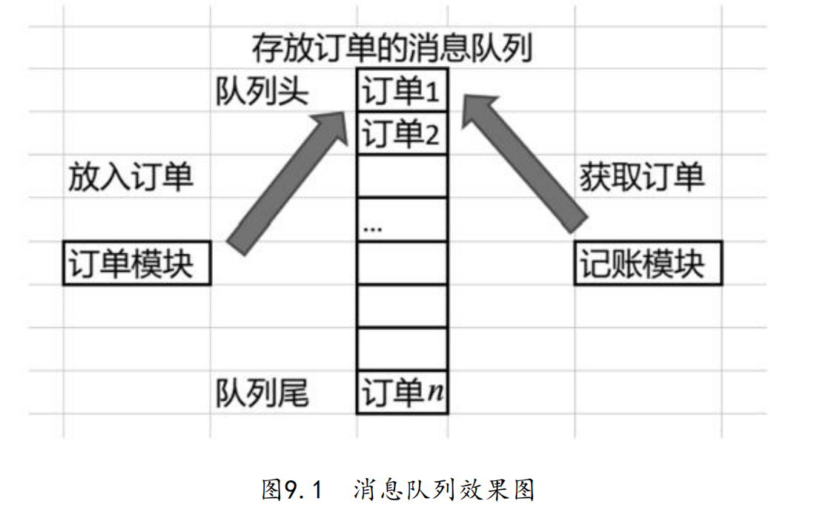
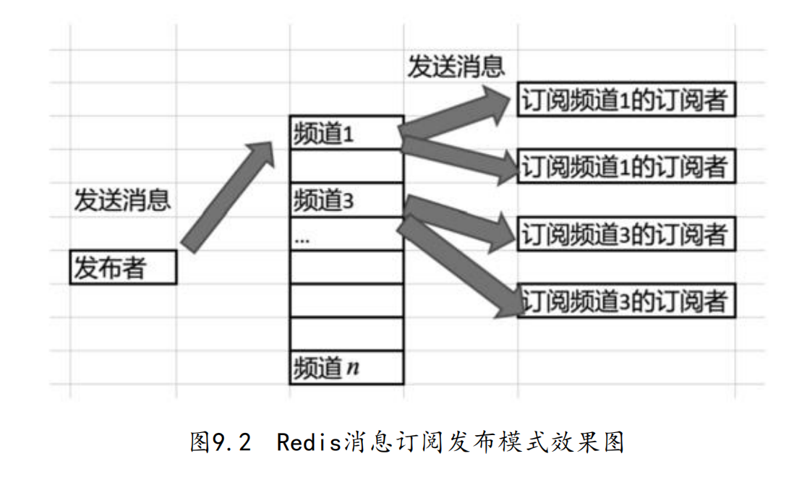

# 9.1 Redis消息队列实战

在实际项目中,模块间可以通过消息队列(Message Queue,MQ)来交互数据,比如订单模块在处理好一个订单后可以把该订单对象放入消息队列,而记账模块则可以从该消息中取出订单对象继续执行

## 9.1.1 消息队列与Redis消息订阅发布模式

如下图示,订单模块和记账模块通过MQ交互数据.在MQ中,以FIFO的方式存储订单对象.即:订单模块在队列头部插入订单,记账模块从队列头部获取订单并处理



用MQ来交互数据的好处是"解耦".在刚才的例子中,订单模块和记账模块间在交互数据时无需考虑对方的业务细节.在实际项目中,一般会用到一些成熟的MQ中间件,例如Kafka和RabbitMQ等,而通过Redis的消息订阅和发布模式也能实现MQ的效果

Redis的消息订阅和发布模式是一种消息的通信模式,其中发布者(publisher)可以向指定的频道(channel)发送消息,消息发送后订阅该频道的订阅者(subscriber)能收到消息.如下图示:



其中,每个channel中都包含1个消息队列,当publisher向特定的channel发送多个消息后,这些消息会以队列的形式存储,并被订阅该channel的subscriber处理

这样一来,publisher在发送消息后无需关注有多少个subscriber,也无需关注subscriber处理消息的细节.反之亦然.subscriber也无需关注publisher的细节.也就是说,通过这套消息订阅和发布模式,可以最大限度地解耦模块间的交互动作

## 9.1.2 消息订阅发布的命令和流程


如上图示,存储消息的channel在redisPublisher实例中.当连接redisPublisher实例的客户端创建MQChannel后,连接redisSub1和redisSub2实例的**客户端**会订阅该channel,这样当channel中有消息时,2个客户端能够自动接收消息

- step1. 创建redisPublisher实例并创建channel

编写配置文件:

```
(base) yanglei@yuanhong section9-1 % cat redisPublisher.conf 
# 指定端口
port 6379
```

启动服务:

```
(base) yanglei@yuanhong ~ % redis-server /Users/yanglei/Desktop/StudyRedisBaseOnDocker/conf/chapter9/section9-1/redisPublisher.conf
```

使用客户端连接该实例,并发布消息:

```
(base) yanglei@yuanhong section9-1 % redis-cli
127.0.0.1:6379> PUBLISH myChannel myMessage
(integer) 0
```

- `PUBLISH channel message`
	- 功能: 向指定的频道发送消息.若指定的频道不存在,则会创建一个.返回值表示接收到信息的订阅者数量
	- `channel`:频道名
	- `message`:待发送的消息

- step2. 创建redisSub1客户端,并订阅频道

```
(base) yanglei@yuanhong section9-1 % redis-cli
127.0.0.1:6379> SUBSCRIBE myChannel
Reading messages... (press Ctrl-C to quit)
1) "subscribe"
2) "myChannel"
3) (integer) 1
```

- `SUBSCRIBE channel [channel ...]`
	- 功能:订阅给定的一个或多个频道的信息
	- `channel`:给定的channel名

- step3. 在连接redisPublisher的客户端中发布消息

```
127.0.0.1:6379> PUBLISH myChannel Hello
(integer) 1
```

- step4. 观察redisSub1客户端的订阅结果

```
(base) yanglei@yuanhong section9-1 % redis-cli
127.0.0.1:6379> SUBSCRIBE myChannel
Reading messages... (press Ctrl-C to quit)
1) "subscribe"
2) "myChannel"
3) (integer) 1
1) "message"
2) "myChannel"
3) "Hello"
```

可以看到,客户端成功订阅了`myChannel`频道的消息.因此其他客户端向该channel发送消息,则该客户端立刻就能收到

- step5. 创建redisSub2客户端,并订阅频道

```
(base) yanglei@yuanhong ~ % redis-cli
127.0.0.1:6379> SUBSCRIBE myChannel
Reading messages... (press Ctrl-C to quit)
1) "subscribe"
2) "myChannel"
3) (integer) 1
```

- step6. 在step1的客户端中发布2条消息

```
(base) yanglei@yuanhong section9-1 % redis-cli
127.0.0.1:6379> PUBLISH myChannel Redis
(integer) 2
127.0.0.1:6379> PUBLISH myChannel "Info for MQ"
```

- step7. 观察redisSub1客户端

```
(base) yanglei@yuanhong section9-1 % redis-cli
127.0.0.1:6379> SUBSCRIBE myChannel
Reading messages... (press Ctrl-C to quit)
1) "subscribe"
2) "myChannel"
3) (integer) 1
1) "message"
2) "myChannel"
3) "Redis"
1) "message"
2) "myChannel"
3) "Info for MQ"
```

- step8. 观察redisSub2客户端

```
(base) yanglei@yuanhong ~ % redis-cli
127.0.0.1:6379> SUBSCRIBE myChannel
Reading messages... (press Ctrl-C to quit)
1) "subscribe"
2) "myChannel"
3) (integer) 1
1) "message"
2) "myChannel"
3) "Redis"
1) "message"
2) "myChannel"
3) "Info for MQ"
```

## 9.1.3 消息订阅发布的相关命令汇总

- `PSUBSCRIBE pattern [pattern ...]`
	- 功能:订阅一个或多个符合给定模式的频道

- `UNSUBSCRIBE channel [channel ...]`
	- 退订给定的一个或多个频道

```
127.0.0.1:6379> unSUBSCRIBE myChannel
1) "unsubscribe"
2) "myChannel"
3) (integer) 0
```

## 9.1.4 GO与消息队列的实战范例

由于Pub/Sub并不是常用功能,故本例将使用比较简单的项目结构来演示

### 发布者端

```go
package main

import (
	"github.com/gomodule/redigo/redis"
	"log"
)

func main() {
	conn, err := redis.Dial("tcp", "localhost:6379")
	if err != nil {
		log.Fatal(err)
	}
	defer conn.Close()

	mqMessages := []string{"MQMessage1", "MQMessage2", "MQMessage3", "exit"}

	for _, message := range mqMessages {
		reply, err := conn.Do("PUBLISH", "MQChannel", message)
		if err != nil {
			log.Fatal(err)
		}
		log.Printf("reply: %v", reply)
	}
}
```

### 订阅者端

```go
package main

import (
	"github.com/gomodule/redigo/redis"
	"log"
)

func main() {
	conn, err := redis.Dial("tcp", "localhost:6379")
	if err != nil {
		log.Fatal(err)
	}
	defer conn.Close()

	psc := redis.PubSubConn{Conn: conn}
	// 订阅 MQChannel 频道
	err = psc.Subscribe("MQChannel")
	if err != nil {
		log.Fatal(err)
	}

	for {
		switch v := psc.Receive().(type) {
		case redis.Message:
			log.Printf("Received message from channel %s: %s\n", v.Channel, v.Data)
			if string(v.Data) == "exit" {
				err = psc.Unsubscribe("MQChannel")
				if err != nil {
					log.Fatal(err)
				}
				return
			}

		case redis.Subscription:
			log.Printf("%s: %s %d\n", v.Kind, v.Channel, v.Count)
			// 当取消订阅后 退出循环
			if v.Count == 0 {
				return
			}

		case error:
			log.Fatal(v)
		}
	}
}
```

### 运行

- step1. 运行订阅者

```
(base) yanglei@yuanhong subscriber % go run main.go 
2023/08/28 10:57:08 subscribe: MQChannel 1
```

此时由于发布者尚未发送消息,故订阅者hang在了死循环中

- step2. 运行发布者

```
(base) yanglei@yuanhong publisher % go run main.go 
2023/08/28 10:57:38 reply: 1
2023/08/28 10:57:38 reply: 1
2023/08/28 10:57:38 reply: 1
2023/08/28 10:57:38 reply: 1
```

- step3. 观察订阅者

```
(base) yanglei@yuanhong subscriber % go run main.go 
2023/08/28 10:57:08 subscribe: MQChannel 1
2023/08/28 10:57:38 Received message from channel MQChannel: MQMessage1
2023/08/28 10:57:38 Received message from channel MQChannel: MQMessage2
2023/08/28 10:57:38 Received message from channel MQChannel: MQMessage3
2023/08/28 10:57:38 Received message from channel MQChannel: exit
```

可以看到,订阅者在收到消息后,可以完成跳出死循环的功能